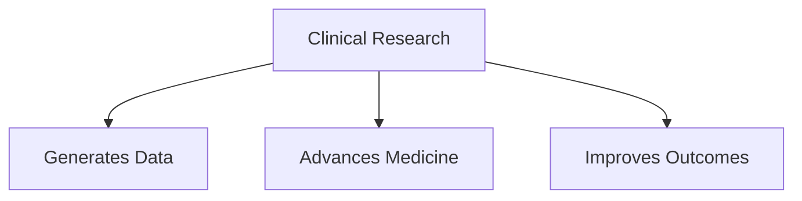
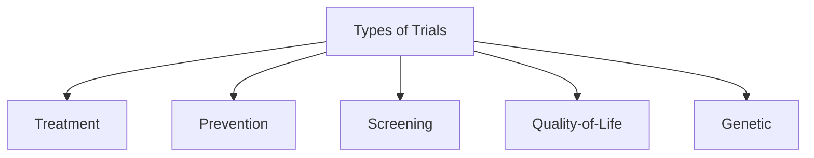
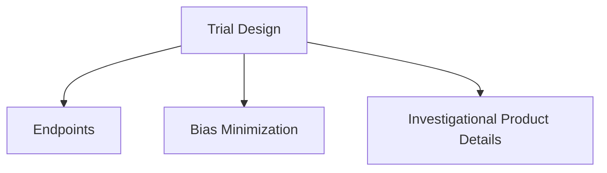
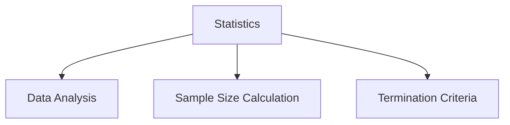
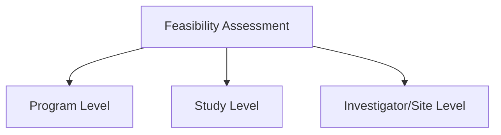
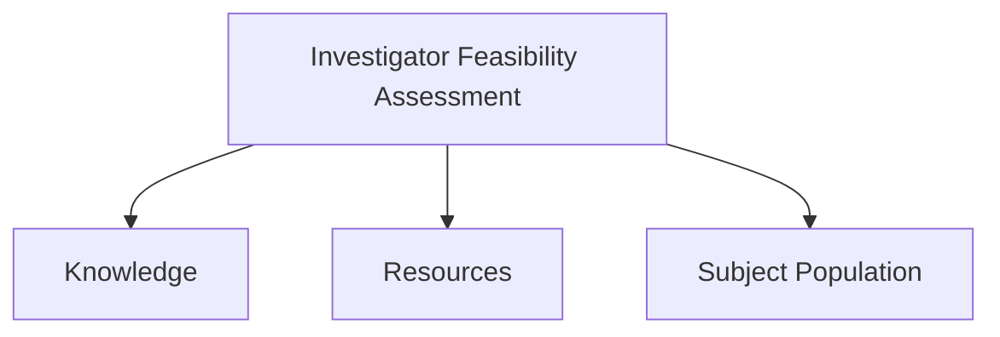
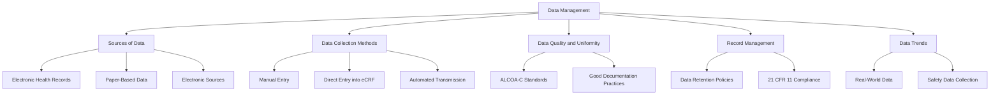
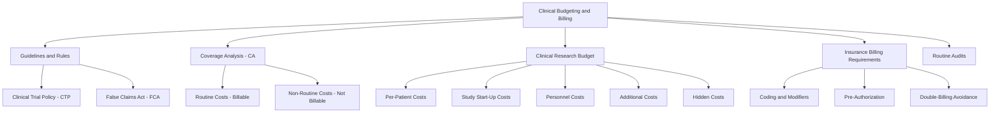

```mermaid
graph TD
    A[Ensuring Compliance] --> B[Good Clinical Practice]
    B --> B1[Principle 8: Qualified Leadership]
    B --> B2[Principle 9: Informed Consent]

    A --> C[Recordkeeping and Privacy]
    C --> C1[Trial Master File]
    C --> C2[HIPAA Privacy & Security Rules]

    A --> D[Research Compliance Programs]
    D --> D1[Policies & Procedures]
    D --> D2[Training & Education]
    D --> D3[Risk Assessments]

    A --> E[Informed Consent]
    E --> E1[Ongoing Communication]
    E --> E2[Error Prevention]

    A --> F[Safety Reporting]
    F --> F1[Adverse Events]
    F --> F2[Serious Adverse Events]
    F --> F3[Unanticipated Problems]

    A --> G[Preventing Misconduct]
    G --> G1[Falsification of Data]
    G --> G2[Fabrication of Results]
    G --> G3[Plagiarism in Research]
    G --> G4[Reporting Misconduct]

```

# Clinical Research Course Summary

## Module 1: Understanding U.S. Clinical Research

### Introduction
Clinical research observes or tests interventions in humans to evaluate health outcomes. It grew significantly post-1940s and continues to expand with legislation like the **21st Century Cures Act**, enhancing biomedical research. Clinical research involves a systematic approach to generating data to advance public health, ensuring that treatments and interventions are safe and effective.

---

### Key Learning Objectives
- Define clinical research and clinical trials.
- Differentiate between clinical research and clinical care.
- Understand the role of clinical research in improving public health.
- Identify obstacles in clinical research operations.
- Recognize themes in the clinical research industry.

---

### Key Concepts

#### What is Clinical Research?
Clinical research:
- Covers a broad spectrum of investigations of interventions and their impact on health outcomes.
- Includes research translating laboratory innovations to the hospital and community.
- Focuses on disease prevalence, prevention, health services, and future interventions.

#### Clinical Trials
**Definitions**:
- **WHO**: Assigns participants to interventions to evaluate health outcomes.
- **NIH**: Assigns participants to interventions for health-related biomedical or behavioral outcomes.

#### Clinical Research vs. Clinical Care
| **Clinical Research**                | **Clinical Care**                 |
|--------------------------------------|-----------------------------------|
| Goal: Answer research questions     | Goal: Diagnose and treat patients |
| May involve experimental methods    | Uses standard procedures          |
| Focused on data generation          | Focused on patient outcomes       |

**Key Issue**: Therapeutic misconception—confusion between research participation and medical treatment.

#### Role of Clinical Research in Public Health
- **Generates scientific data**: Tests efficacy, potency, and side effects.
- **Revolutionizes medicine**: Advances treatments for diseases like cancer and diabetes.
- **Improves health outcomes**: Enables better medications and interventions.

#### Organizational Challenges
| **Challenges**                     | **Solutions**                                         |
|------------------------------------|-----------------------------------------------------|
| Insufficient funding               | Increase budgets and partnerships                   |
| Regulatory burdens                 | Harmonize and simplify policies                     |
| Translational obstacles            | Build infrastructure connecting labs to clinics     |
| Limited public understanding       | Enhance awareness and research ethics training      |

---

## Module 2: Common Types of Clinical Trials

### Introduction
Clinical trials test new drugs, devices, or interventions to determine safety and efficacy. They are essential for developing better treatments, advancing medicine, and improving public health.

---

### Key Learning Objectives
- Define clinical trial designations and common types of trials.
- Differentiate between clinical trial categories.
- Identify differences between clinical trial study designs.

---

### Clinical Trial Categories

#### Interventional
- Investigators outline specific interventions for subjects.
- Examples: Testing new drugs, devices, or behavioral therapies.

#### Observational
- Investigators collect and analyze data without intervention.
- Examples: Observing the effects of lifestyles on cardiac health.

---

### Phases of Clinical Trials

#### Early Phase
- Exploratory studies to determine merit for further exploration.

#### Phase I
- **Participants**: 20–80 healthy individuals.
- **Focus**: Safety, toxicity, side effects, and dosage.

#### Phase II
- **Participants**: 100–300 individuals.
- **Focus**: Effectiveness and safety.

#### Phase III
- **Participants**: 1,000–3,000 individuals.
- **Focus**: Multi-site testing, effectiveness confirmation, and safety.

#### Phase IV
- Conducted post-FDA approval to evaluate long-term safety and benefits.

---

### Types of Clinical Trials
- **Treatment Trials**: Focus on new treatments or devices.
- **Prevention Trials**: Investigate ways to prevent diseases.
- **Screening Trials**: Test methods for early disease detection.
- **Quality-of-Life Trials**: Aim to improve chronic illness management.
- **Genetic Trials**: Study genetic influences on health.

---

### Study Design and Subject Selection

#### Study Designs
- **Cross-sectional**: Compare groups at one point in time.
- **Longitudinal**: Follow groups over time.
- **Randomized**: Assign participants to groups by chance.

#### Subject Selection
- **Inclusion/Exclusion Criteria**: Define participant eligibility.
- **Randomization**: Reduces bias and ensures fairness.
## Module 3: Critical U.S. Federal Regulations and Oversight Bodies

### Introduction
Federal regulations ensure clinical research maintains ethical standards and protects participants while producing reliable data for drug and device approvals.

---

### Key Learning Objectives
- Understand ethical principles guiding clinical research.
- Explain the FDA’s role in clinical investigations.
- Discuss regulations governing informed consent and IRBs.
- Identify international GCP standards for multinational research.

---

### Ethical Framework

#### Key Principles
- **Respect for Persons**: Autonomy and informed consent.
- **Beneficence**: Minimize harm and maximize benefits.
- **Justice**: Fair allocation of research benefits and burdens.

---

### FDA’s Role

#### Organizational Structure
- **CDER**: Oversees drugs.
- **CDRH**: Regulates devices.
- **CBER**: Focuses on biologics.

#### Jurisdiction
- Covers drugs, biologics, and devices.
- Requires adherence to **Good Laboratory Practice (GLP)**, **Good Clinical Practice (GCP)**, and **Good Manufacturing Practice (GMP)** standards.

---

### Key Regulations

#### Institutional Review Boards (IRBs)
- Ensure ethical oversight of studies.
- Approve and monitor research protocols.

#### Informed Consent (21 CFR 50)
- Participants must voluntarily agree to participate after understanding risks and benefits.

#### Investigational Applications
- **Drugs**: IND applications required.
- **Devices**: IDEs required for significant risk devices.

---

### International Standards
- **ICH GCP**: Harmonized standards for global research.
- **ISO 14155**: Focuses on medical device trials.

---

### Summary
Clinical research regulations ensure the safety of participants and the integrity of data. Understanding the FDA’s role, ethical principles, and global standards is crucial for conducting compliant and impactful studies.

---

## Module 4: Overview of the Clinical Research Enterprise

### Introduction
The clinical research enterprise involves multiple stakeholders, including the NIH, FDA, and Centers for Medicare and Medicaid Services, working collaboratively to advance public health.

---

### Key Learning Objectives
- Understand the roles of PIs, IRBs, and sponsors in clinical research.
- Identify support functions in clinical research.
- Explore factors influencing the organization of clinical research enterprises.
- Discuss workforce challenges and future needs.

---

### Regulatory Framework
The FDA’s authority stems from key regulations:
- **21 CFR 50**: Protection of Human Subjects.
- **21 CFR 56**: Institutional Review Boards.
- **21 CFR 312**: Investigational New Drug Applications.
- **21 CFR 812**: Investigational Device Exemptions.

---

### Roles and Responsibilities

#### Principal Investigator (PI)
- Leads clinical investigations.
- Ensures protocol compliance and participant safety.

#### Institutional Review Board (IRB)
- Reviews and monitors research to protect participants.
- Approves informed consent processes and recruitment materials.

#### Sponsor
- Provides resources and oversight for clinical trials.
- Ensures regulatory compliance and ethical research conduct.

---

### Support Structures in Clinical Research

#### Contract Research Organizations (CROs)
- Manage clinical trial operations, including data management and monitoring.

#### Human Research Protection Programs (HRPPs)
- Integrate IRBs into broader systems ensuring participant protections.

#### Site-Level Support
- Includes research pharmacies, billing offices, and clinical trial offices to streamline trial processes.

---

### Workforce Challenges and Future Needs
- Increasing trial complexity requires a skilled and adaptable workforce.
- Remote and virtual roles, such as data managers and patient guides, are expanding.
- Competencies include research design, ethical considerations, and teamwork.

---
# Module 5: Overview of a Protocol and Designing a Clinical Trial

## Introduction
A research protocol serves as the blueprint for clinical trials, documenting the study plan, objectives, and procedures. It guides investigators, sponsors, IRBs, and other stakeholders while ensuring compliance with ethical and regulatory standards.

---

## Learning Objectives
By the end of this module, you should be able to:
1. Describe the purpose and primary uses of a research protocol.
2. Define common informational elements within a protocol.
3. Identify levels of study feasibility assessment and explain the components of an investigator feasibility assessment.

---

## Purpose of a Protocol
The protocol is essential for:
- Pre-study ethical and safety review.
- Ensuring uniformity and quality of study conduct.
- Supporting post-study evaluation.

### Stakeholder Use of Protocols
| **Stakeholder**         | **Purpose**                                                                 |
|--------------------------|-----------------------------------------------------------------------------|
| Investigators            | Identify study rationale, eligibility, safety, and withdrawal conditions.  |
| IRBs/Ethics Committees   | Evaluate risk minimization, equitable subject selection, and data quality. |
| Sponsors/Funders         | Articulate methods, ensure consistency, and define monitoring mechanisms.  |

---

## Developing and Testing Research Questions

### Research Questions, Objectives, and Endpoints
- **Research Questions**: Define what the study aims to answer.
- **Objectives**: General (e.g., safety) or specific (e.g., dose-response).
- **Endpoints**: Specific measurements that assess whether objectives are met.

| **Objective**                              | **Endpoint**                     |
|--------------------------------------------|-----------------------------------|
| Investigate the efficacy of a drug on tumors | Tumor reduction at six weeks.    |

---

## Protocol Sections
### Key Protocol Elements
The following elements ensure a structured and comprehensive research study:

#### General Information
- Protocol title, sponsor details, investigator contact information.

#### Background
- Summarizes prior studies, known risks, investigational product details.

#### Trial Objectives and Purpose
- Describes the study's purpose and primary/secondary objectives.

#### Trial Design
- Includes trial type, endpoints, and measures to minimize bias.

#### Selection and Withdrawal of Subjects
- Specifies eligibility criteria and subject withdrawal conditions.

#### Investigational Treatment of Subjects
- Details investigational treatment plans and compliance monitoring.

#### Assessment of Efficacy and Safety
- Describes safety and efficacy monitoring parameters.

#### Statistics
- Outlines methods for data analysis, sample size, and trial termination.

#### Source Data, Record Keeping, and QC/QA
- Ensures data integrity, access permissions, and adherence to quality assurance standards.

#### Ethics
- Covers ethical considerations and applicable frameworks.

#### Trial Registration
- Specifies public database registration (e.g., ClinicalTrials.gov).

---

## Feasibility Assessment

### Levels of Feasibility
Feasibility is assessed at:
1. **Program Level**: High-level focus on diseases and market opportunities.
2. **Study Level**: Feasibility of specific study designs and operational capabilities.
3. **Investigator/Site Level**: Assess investigator expertise, resources, and patient access.

---

### Investigator Feasibility Assessment
Factors to consider:
1. **Investigator Knowledge and Obligations**:
   - Expertise in disease treatment and conducting clinical trials.
   - Time commitment and competing obligations.
2. **Resources and Facilities**:
   - Access to equipment, space, and operational capacity.
3. **Subject Population**:
   - Availability of eligible participants within the region.

---

## Templates and Resources

### Protocol Templates
1. **SPIRIT Guidelines**: Enhance transparency and consistency.
2. **NIH Templates**: For FDA-regulated and behavioral/social science research.
3. **WHO Format**: Comprehensive protocol documentation.

### Protocol Writing Resources
- Refer to FDA regulations, institutional training programs, and published guidelines.

---
# Module 6 Summary: Data Management

## Introduction
Data management is essential for ensuring the integrity and validity of clinical research studies. Proper methods for capturing, collecting, and managing data are critical to evaluating clinical objectives and endpoints. This module discusses data sources, collection methods, good documentation practices, and trends in data management.

---

## Learning Objectives
By the end of this module, you should be able to:
- Identify data sources and understand their impact on data collection, reporting, and quality oversight.
- Describe methods for collecting data from various sources such as EHRs, other electronic records, and paper.
- Define good documentation and data management practices for maintaining data quality and accuracy.

---

## Key Concepts

### Data Overview
- **Source Data**: Original records used for evaluating the research.
- **Source Documents**: Specific records where source data is stored.
- **Electronic Health Record (EHR)**: Electronic platforms containing individual health records.
- **Electronic Record**: Digitized text, graphics, or data created and maintained by a computer system.

### Sources of Data
1. **Electronic Health Records (EHRs)**:
   - Capture patient demographics, vital signs, medical history, lab results, etc.
2. **Paper-Based Data**:
   - Includes patient-completed questionnaires, consent forms, and study-specific assessments.
3. **Electronic Sources**:
   - Examples: Radiology systems, wearable devices, and patient diaries.

### Data Collection Methods
1. **Manual Entry**: Transcribing data from paper to electronic systems; prone to errors.
2. **Direct Entry into eCRF**: Real-time data entry directly into the sponsor's electronic system.
3. **Automated Transmission**: Direct data transfer from EHRs or devices to the EDC system.

### Data Quality, Integrity, and Uniformity
- **ALCOA-C Standards**:
  - Attributable
  - Legible
  - Contemporaneous
  - Original
  - Accurate
  - Complete
- **Best Practices**:
  - Include time stamps, audit trails, and validation of modifications.
  - Ensure data modifications or corrections are properly documented.

---

## Key Sections

### Data and Record Management
- Investigators must maintain accurate subject case histories and submit validated data to sponsors.
- Electronic systems should comply with **21 CFR 11** (Electronic Records and Signatures).

### Research Data Standards
- No universal data standard exists, but groups like CDISC and AHRQ are developing standards.

### Record Retention
- **FDA Requirements**:
  - Maintain records for at least two years post-marketing application approval or study termination.

### Data Trends
1. **Real-World Data (RWD)**:
   - Includes EHR data, patient-generated data, and wearable devices.
   - Can supplement clinical trial data for regulatory decisions.
2. **Safety Data**:
   - Focus on collecting only necessary safety data to reduce investigator burden.

---

## Summary Chart with Mermaid Visualization

---
# Module 7: Ensuring Compliance

## Content Author
**Kelly Willenberg, DBA, MBA**  
*Kellly Willenberg & Associates*

---

## Introduction
Compliance ensures research integrity and the protection of human subjects in clinical trials. It involves ethical and regulatory adherence, minimizing harm, obtaining informed consent, protecting confidentiality, and ensuring proper communication. This module emphasizes the role of compliance in reducing risks and preventing misconduct.

---

## Learning Objectives
- Discuss how compliance with Good Clinical Practice (GCP) supports clinical research.
- Describe HIPAA's application to privacy and confidentiality.
- Identify key areas of research compliance programs.
- Explain types of scientific misconduct and prevention methods.

---

## Key Concepts

### Good Clinical Practice (GCP)
GCP ensures ethical and scientific integrity in clinical trials. It includes:
- **Principle 8**: Qualified individuals should lead the trials.
- **Principle 9**: Freely obtained informed consent is mandatory.

#### GCP Compliance and Competency
- **Compliance**: Ensures adherence to GCP guidelines.
- **Competency**: Focuses on leadership, team mentoring, and subject-focused communication.

---

### Recordkeeping and Privacy Compliance
- **Trial Master File (TMF)**: Centralized document ensuring accountability.
- **HIPAA**: Protects both physical and electronic health information (PHI).

#### HIPAA Highlights
- Privacy Rule governs PHI sharing.
- Security Rule safeguards electronic PHI (ePHI).
- De-identified data is exempt from HIPAA regulations.

---

### Research Compliance Programs
Key components:
1. **Policies and Procedures**: Establish roles and guidelines.
2. **Training and Education**: Build GCP competency.
3. **Risk Assessments**: Identify vulnerabilities.

Additional areas to consider:
- **Funding**: Ethical considerations in financing research.
- **Legal and Regulatory Adherence**: Ensures human subject safety.
- **Auditing and Monitoring**: Distinguishes between periodic audits and continuous monitoring.

---

### Informed Consent Compliance
- Ongoing communication ensures informed decision-making.
- Avoid **Disclosure Errors** (missing necessary information) and **Facilitation Errors** (jargon or coercion).

---

### Safety Reporting
Safety reporting safeguards subjects. It includes:
- **Adverse Events (AEs)**: Any negative medical occurrence.
- **Serious Adverse Events (SAEs)**: Significant health impacts requiring immediate reporting.
- **Unanticipated Problems**: Unexpected risks impacting subjects or others.

---

### Preventing Misconduct
- Misconduct includes **falsification**, **fabrication**, and **plagiarism**.
- Reporting potential misconduct is a shared responsibility.
- Responses require confidentiality and thorough investigations.

---

## Summary
Compliance integrates ethical principles into research to protect subjects, ensure data integrity, and minimize risks. From adhering to GCP to preventing misconduct, compliance serves as the backbone of ethical clinical research.

---

## Summary Chart with Mermaid Visualization

---
# Module 8: Overview of Clinical Budgeting and Billing in Research

## Content Author
**Marie Jackson, PhD, MBA**  
Methodist le Bonheur Healthcare  

---

## Introduction

Clinical trial sites must manage and cover costs associated with conducting research. This includes:
- Creating a **Coverage Analysis (CA)** to outline tests and procedures billable to sponsors or insurers.
- Ensuring accurate billing to prevent risks like **double-billing** or violating the **False Claims Act (FCA)**.
- Tracking hidden costs and negotiating budgets effectively.

---

## Learning Objectives

By the end of this module, you should be able to:
1. Describe CMS guidelines and rules for research billing.
2. Discuss risks of incorrect billing.
3. Explain the purpose and components of a CA.
4. Define the components of a clinical research budget.
5. Identify hidden costs in research.
6. Discuss insurance billing requirements.

---

## Guidelines and Rules for Research Billing

### Clinical Trial Policy (CTP)
- **1965**: Medicare/Medicaid created.
- **2000**: CMS expanded to include research billing.
- **2007**: CTP revised to guide Medicare coverage for routine patient care in clinical trials.

### False Claims Act (FCA)
- Imposes liability for knowingly or unknowingly submitting false claims to the government.
- Penalties (2020): $11,665–$23,331 per violation plus 3x the amount of each claim.

---

## Coverage Analysis (CA)

### Purpose
- Identify all items and services for each study visit.
- Determine who pays for what (e.g., sponsor, CMS, insurer).

### Routine Costs (Billable)
- Items/services typically covered outside a trial.
- Costs for administering investigational items.
- Monitoring and managing investigational effects.

### Non-Routine Costs (Not Billable)
- Costs for data collection not tied to clinical care.
- Sponsor-provided items/services offered for free.

---

## Clinical Research Budget

### Budget Components
1. **Per-Patient Costs**:
   - Tests, procedures, pharmacy, laboratory fees, and patient stipends.
2. **Study Start-Up Costs**:
   - IRB fees, regulatory support, and budget development.
3. **Personnel Costs**:
   - Time/effort of investigators, coordinators, and data managers.
4. **Additional Costs**:
   - Screen failures, unscheduled visits, document storage, and recruitment.

### Hidden Costs
- Examples: Training, advertising, safety reporting, and medical supplies.

---

## Insurance Billing Requirements

1. **Coding**:
   - National Clinical Trial (NCT) number, modifiers (Q1, Q0), condition codes (30, 53).
2. **Pre-Authorization**:
   - Required for commercial payers but not Medicare.
3. **Double-Billing**:
   - Avoid billing insurers for sponsor-paid items.

---

## Routine Audits
- Reconcile claims with the CA to catch billing errors early.
- Refund government payers for any errors within 60 days.

---

## Summary

Accurate budgeting and billing are critical for maintaining compliance and ensuring clinical trials are financially sustainable. Sites must:
- Create CA grids to reduce risks of billing errors.
- Negotiate budgets using CA insights.
- Track and audit charges throughout the study.

---

## Summary Chart with Mermaid Visualization

### Summary
The clinical research enterprise depends on collaboration among investigators, IRBs, sponsors, and auxiliary offices. With evolving technologies and increasing trial complexities, it requires robust support structures and a skilled workforce to ensure excellence and innovation.
