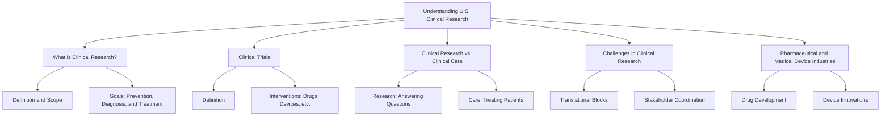

# Understanding U.S. Clinical Research

## Introduction
Clinical research has evolved over centuries to become a critical means for answering questions about interventions and their impact on health outcomes. This module provides a comprehensive understanding of clinical research in the U.S., exploring its purpose, processes, challenges, and stakeholders.

---

## Learning Objectives
By the end of this module, you should be able to:
- Define clinical research and clinical trials.
- Contrast clinical research with clinical care.
- Describe the role clinical research plays for organizations and public health.
- Identify key challenges and stakeholders in clinical research.
- Understand the role of the pharmaceutical and medical device industries.

---

## Key Concepts

### What is Clinical Research?
- A branch of biomedical research that observes or tests interventions in humans in a systematic manner.
- Includes medicines, medical devices, behavioral treatments, etc.
- Aims to determine whether interventions are safe and effective.
- **Purpose**: Prevent, diagnose, and treat diseases while improving public health.

### Clinical Trials
- Research studies involving human participants assigned to interventions to evaluate their effects on health-related outcomes.
- Common interventions include:
  - Drugs, medical devices, radiological procedures.
  - Preventive care and behavioral treatments.

**Clinical Trials vs. Clinical Research:**
- **Clinical Research**: Encompasses all research involving humans, including secondary studies.
- **Clinical Trials**: Specifically involve human participants assigned to an intervention.

---

## Clinical Research vs. Clinical Care
- **Clinical Research**:
  - Primary goal: Answer research questions.
  - Participants are "subjects" contributing to data generation.
- **Clinical Care**:
  - Primary goal: Benefit the patient through treatment.
  - Standard therapies are used for optimal outcomes.
  
Key Challenge: "Therapeutic Misconception" - Participants often confuse research with routine medical care.

---

## Why Conduct Clinical Research?
- Improves public health by developing treatments and understanding diseases.
- Generates significant scientific data:
  - Medication efficacy and dosing.
  - Side effects and impacts on diverse populations.
- **Historical Impact**:
  - Reduction in coronary heart disease death rates by 50% (1980–2000).
  - Innovations driven by federal agencies, pharmaceutical, and medical device industries.

---

## Challenges in Clinical Research
### Translational Blocks
- Difficulty moving findings from basic science to practical applications.
- Issues translating clinical trial results into clinical practice.

**Key Challenges**:
- Lack of willing participants.
- Regulatory burdens and fragmented infrastructure.
- Career disincentives and high research costs.

### Stakeholders
- **Participants**: Research subjects, investigators, and research organizations.
- **Sponsors**: Government agencies, pharmaceutical, and biotech companies.
- **Regulators**: IRBs, FDA, and professional organizations.
- **Beneficiaries**: Patients, scientists, and public health systems.

---

## Pharmaceutical and Medical Device Industries
- **Pharmaceutical Industry**:
  - Develops medications and vaccines to prevent and treat diseases.
  - Faces challenges like patent expirations and drug pricing pressures.
  - Opportunities in outsourcing and emerging markets.
- **Medical Device Industry**:
  - Develops healthcare products ranging from imaging systems to prosthetics.
  - Continuously innovates based on physician input and technological advancements.
  - Challenges include cybersecurity concerns and regulatory complexities.

---

## Role of Clinical Research
- Bridges basic science and public health.
- Requires investment in infrastructure and coordination among stakeholders.
- Drives medical advancements by translating discoveries into meaningful outcomes.

---

## Summary Chart

---

## Conclusion
Clinical research is integral to advancing public health. It provides the foundation for innovative treatments, technologies, and improved patient outcomes. While challenges remain, effective collaboration among stakeholders ensures the growth and impact of clinical research.
