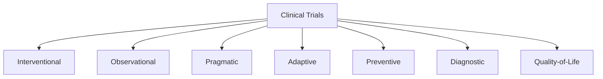
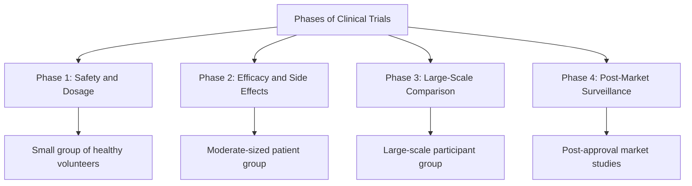
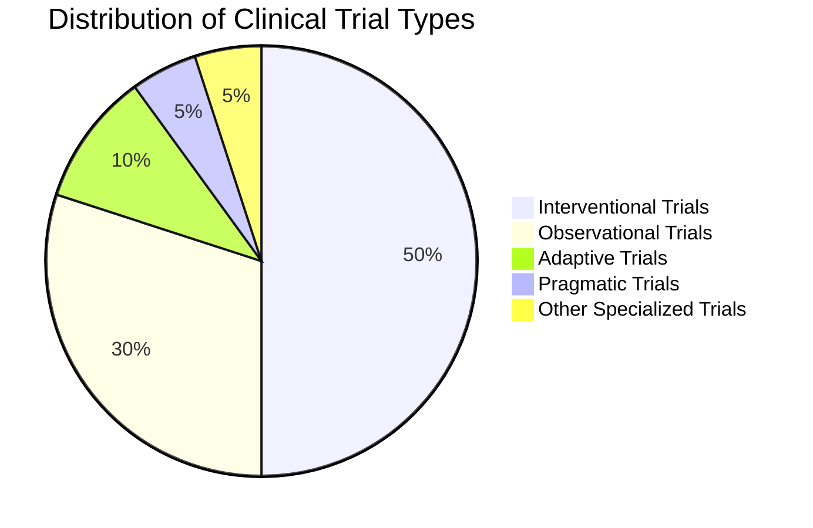

# Module 2: Common Types of Clinical Trials

## **Overview**
Clinical trials play a pivotal role in advancing medical research by evaluating the safety, efficacy, and overall impact of interventions on human health. This module categorizes clinical trials based on their design, purpose, and methodology, providing a comprehensive framework to understand their unique characteristics.

---

## **Learning Objectives**
By the end of this module, you should be able to:
1. Identify the main types and phases of clinical trials.
2. Differentiate between interventional and observational studies.
3. Describe specialized trial types, including adaptive and pragmatic trials.
4. Recognize ethical and logistical challenges in trial design and execution.

---

## **Types of Clinical Trials**

### 1. **Interventional Trials**
- Purpose: Test the effects of a specific intervention (e.g., drug, device, or procedure) on participants.
- Example: Testing a new cancer drug to reduce tumor growth.

### 2. **Observational Trials**
- Purpose: Observe outcomes without assigning interventions.
- Examples:
  - **Cohort Studies**: Follow a group over time.
  - **Case-Control Studies**: Compare groups with and without a condition.

### 3. **Pragmatic Trials**
- Focus on real-world effectiveness rather than controlled conditions.
- Example: Comparing two diabetes management programs in diverse populations.

### 4. **Adaptive Trials**
- Utilize interim data to modify trial aspects dynamically (e.g., sample size, dosage).
- Benefit: Increases efficiency and reduces resource waste.

### 5. **Preventive Trials**
- Purpose: Explore ways to prevent diseases in healthy individuals.
- Example: Testing a vaccine for flu prevention.

### 6. **Diagnostic Trials**
- Purpose: Assess the accuracy and efficacy of diagnostic tests.
- Example: Evaluating a new imaging technique for early cancer detection.

### 7. **Quality-of-Life Trials**
- Focus on improving life quality for patients with chronic diseases.
- Example: Studying interventions to alleviate chemotherapy side effects.

---

## **Phases of Clinical Trials**

Clinical trials progress through **four phases**, each addressing different research objectives.

### **Phase 1: Safety and Dosage**
- Small group of healthy volunteers (20-100 participants).
- Purpose: Assess safety, dosage levels, and side effects.

### **Phase 2: Efficacy and Side Effects**
- Larger group of patients (100-300 participants).
- Purpose: Evaluate efficacy and monitor for adverse effects.

### **Phase 3: Large-Scale Comparison**
- Thousands of participants across multiple sites.
- Purpose: Confirm efficacy, monitor adverse effects, and compare to standard treatments.

### **Phase 4: Post-Market Surveillance**
- Conducted after FDA approval.
- Purpose: Gather additional data on safety and long-term effects.

---

## **Key Considerations in Trial Design**

### 1. **Ethical Considerations**
- **Informed Consent**: Ensure participants understand risks and benefits.
- **IRB Oversight**: Safeguard participant rights and safety.

### 2. **Participant Recruitment**
- Diverse and representative sample populations are essential.
- Challenge: Engaging underrepresented groups.

### 3. **Logistical Challenges**
- High operational costs.
- Compliance with regulatory frameworks like FDA and GCP.

---

## **Specialized Trial Types**

### **Pragmatic vs. Explanatory Trials**
- Pragmatic: Real-world conditions, broader populations.
- Explanatory: Controlled environments, highly specific criteria.

### **Adaptive Designs**
- Example: Early results from a cancer trial show efficacy; adjust dosage accordingly.

---

## **Ethical and Regulatory Oversight**

### 1. **Good Clinical Practice (GCP)**
- Ensures ethical, scientific, and quality standards.

### 2. **Institutional Review Boards (IRBs)**
- Approve trial protocols.
- Monitor ongoing compliance with ethical standards.

---

## **Challenges in Clinical Trials**

### 1. **Recruitment and Retention**
- Barriers: Geographic access, participant awareness.
- Solution: Community outreach programs.

### 2. **High Costs**
- Funding is required for site operations, personnel, and equipment.

### 3. **Regulatory Compliance**
- Adherence to global and local standards (e.g., FDA, EMA, ICH).

---

## **Summary**

Clinical trials are integral to advancing healthcare by evaluating new interventions under rigorous scientific and ethical standards. By understanding their phases, types, and challenges, researchers can design effective trials that generate meaningful outcomes.

---
