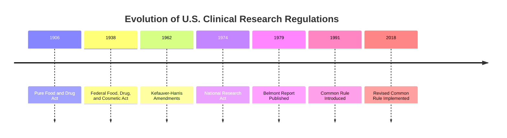
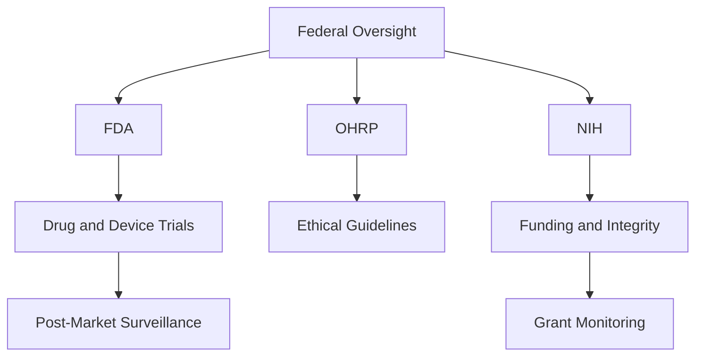
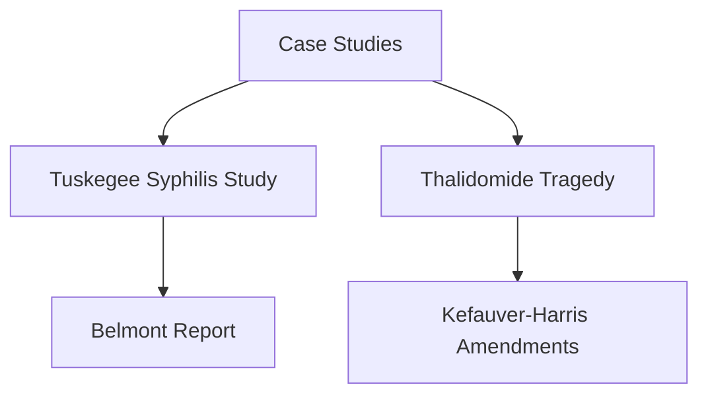
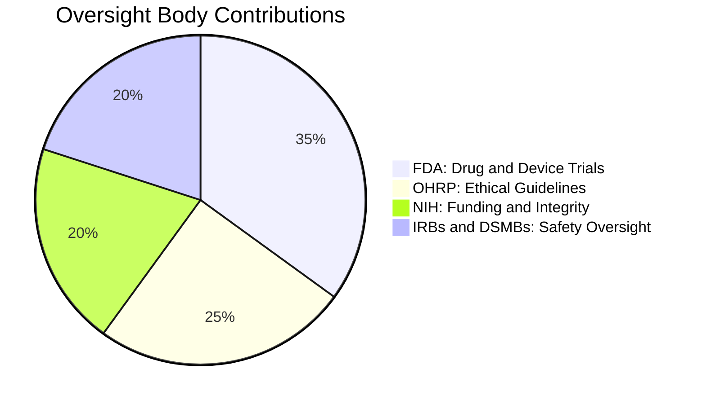

# Module 3: Critical U.S. Federal Regulations and Oversight Bodies in Clinical Research

## **Overview**
Clinical research in the U.S. operates under stringent regulations and oversight to ensure participant safety, ethical conduct, and data integrity. This module provides a comprehensive overview of the key federal regulations, their historical context, the roles of oversight bodies, and the processes involved in maintaining compliance.

---

## **Learning Objectives**
By the end of this module, you will be able to:
1. Identify major federal regulations governing clinical research.
2. Explain the roles and responsibilities of key oversight agencies such as the FDA, OHRP, and NIH.
3. Recognize the historical events that shaped current regulatory frameworks.
4. Understand the compliance process for investigational drugs, biologics, and devices.
5. Address challenges in navigating complex regulatory landscapes.

---

## **Historical Evolution of Federal Regulations**

### Key Milestones:
1. **1906: Pure Food and Drug Act**
   - Prohibited the sale of misbranded or adulterated drugs and food.
2. **1938: Federal Food, Drug, and Cosmetic Act (FDCA)**
   - Required drugs to be tested for safety before marketing.
3. **1962: Kefauver-Harris Amendments**
   - Mandated efficacy data and informed consent after the Thalidomide tragedy.
4. **1974: National Research Act**
   - Created the National Commission for the Protection of Human Subjects.
   - Introduced the **Belmont Report** (1979), outlining key ethical principles.

### **Mermaid Chart: Evolution of Regulations**

---

## **Key Federal Regulations**

### 1. **21 CFR Parts 50, 56, 312, and 812**
- **Part 50**: Informed consent requirements.
- **Part 56**: IRB operations and responsibilities.
- **Part 312**: Processes for Investigational New Drug (IND) applications.
- **Part 812**: Requirements for Investigational Device Exemption (IDE) studies.

### 2. **The Belmont Report (1979)**
- Established three ethical principles:
  1. **Respect for Persons**: Autonomy and protection of vulnerable populations.
  2. **Beneficence**: Maximizing benefits and minimizing harm.
  3. **Justice**: Fair distribution of research burdens and benefits.

### 3. **The Common Rule (45 CFR 46)**
- Applicable to federally funded research.
- Requires IRB oversight, informed consent, and additional protections for vulnerable populations (e.g., children, prisoners).

---

## **Key Oversight Bodies**

### 1. **U.S. Food and Drug Administration (FDA)**
- Oversees drug, biologic, and device trials.
- Conducts pre- and post-approval inspections.
- Monitors compliance with Good Clinical Practice (GCP).

### 2. **Office for Human Research Protections (OHRP)**
- Administers the Common Rule.
- Provides guidance on ethical conduct in federally funded studies.

### 3. **National Institutes of Health (NIH)**
- Funds biomedical research.
- Sets policies for grant recipients to ensure compliance.

### 4. **Institutional Review Boards (IRBs)**
- Approve and monitor clinical trials to ensure ethical and regulatory compliance.

### 5. **Data and Safety Monitoring Boards (DSMBs)**
- Independently monitor safety and data integrity during trials.
- Can recommend modifications or termination of a trial if safety concerns arise.

### **Oversight Interaction Diagram**

---

## **Regulatory Compliance Workflow**

### 1. **Institutional Review Board (IRB) Review**
- Protocols must be submitted for approval before initiating research.
- IRBs evaluate:
  - Ethical considerations.
  - Risk-benefit analysis.
  - Informed consent processes.

### 2. **Investigational New Drug (IND) Applications**
- Required for testing unapproved drugs or biologics in humans.
- Submission includes:
  - Preclinical data.
  - Study design.
  - Investigator qualifications.

### 3. **Investigational Device Exemption (IDE)**
- Allows clinical testing of unapproved devices.
- Requires demonstration of safety and efficacy.

### 4. **Ongoing Monitoring**
- DSMBs ensure participant safety.
- Periodic audits by oversight bodies, such as the FDA.

---

## **Challenges in Compliance**

### 1. **Complexity of Regulations**
- Overlapping federal, state, and institutional requirements.
- Requires dedicated regulatory teams.

### 2. **Globalization**
- Harmonizing U.S. regulations with international guidelines (e.g., ICH, EMA).

### 3. **Emerging Technologies**
- Adapting frameworks for AI, digital health tools, and decentralized trials.

---

## **Case Studies in Regulatory History**

### 1. **Tuskegee Syphilis Study (1932–1972)**
- Ethical violations highlighted the need for participant protections.
- Influenced the creation of the Belmont Report and Common Rule.

### 2. **Thalidomide Tragedy (1950s–1960s)**
- Birth defects caused by inadequate drug testing led to the Kefauver-Harris Amendments, mandating efficacy and safety data.

### **Case Study Summary Chart**

---

## **Summary**

U.S. clinical research is governed by a robust set of federal regulations and oversight mechanisms aimed at ensuring participant safety and research integrity. Adherence to these regulations, coupled with ethical principles, forms the foundation of trustworthy clinical research.

Key Takeaways:
- Federal regulations such as 21 CFR and the Common Rule establish comprehensive guidelines for research conduct.
- Oversight bodies, including the FDA, OHRP, and IRBs, play critical roles in enforcing these standards.
- Historical cases like the Tuskegee Study underscore the importance of ethical and regulatory vigilance.

By understanding and complying with these regulations, researchers can advance scientific innovation while safeguarding human participants.
