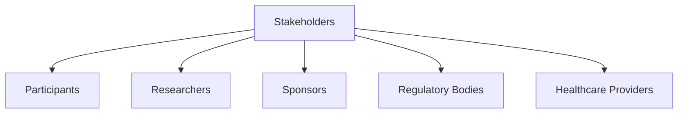
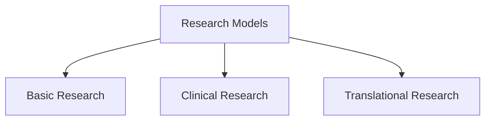
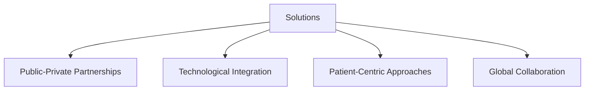
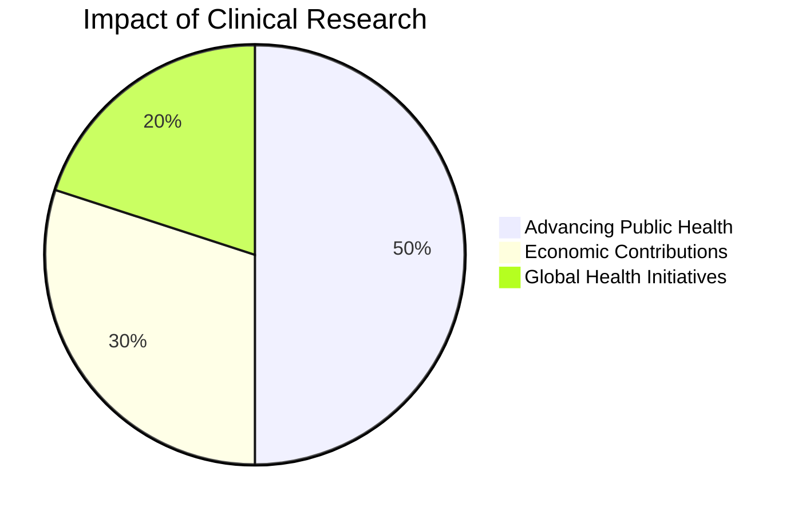

# Module 4: Overview of the Clinical Research Enterprise

## **Overview**
The clinical research enterprise serves as a bridge between basic scientific discoveries and practical applications in healthcare. It is a complex, multidisciplinary effort involving multiple stakeholders, institutions, and regulatory frameworks. This module examines the components of the clinical research enterprise, challenges it faces, and its role in advancing public health.

---

## **Learning Objectives**
By the end of this module, you should be able to:
1. Explain the structure and components of the clinical research enterprise.
2. Identify key stakeholders and their roles.
3. Discuss challenges facing the enterprise and potential solutions.
4. Understand the importance of collaboration among research entities.

---

## **Key Components of the Clinical Research Enterprise**

### 1. **Stakeholders**
The clinical research enterprise is a collaborative effort involving various stakeholders:

#### **Major Stakeholders**
1. **Participants**: Study subjects, including patients and healthy volunteers.
2. **Researchers**: Principal investigators, research staff, and clinical trial coordinators.
3. **Sponsors**: Pharmaceutical companies, government agencies (e.g., NIH), and non-governmental organizations.
4. **Regulatory Bodies**: FDA, EMA, and local Institutional Review Boards (IRBs).
5. **Healthcare Providers**: Hospitals, academic medical centers, and community health organizations.

#### **Flow of Contributions**
Stakeholders contribute to the clinical research process through funding, oversight, and operational execution.

---

### 2. **Infrastructure**
Clinical research infrastructure includes:
- **Academic Health Centers**: Provide facilities and expertise.
- **Contract Research Organizations (CROs)**: Offer logistical support and trial management.
- **Community-Based Organizations**: Ensure diverse participant recruitment.
- **Data Systems**: Facilitate data collection, storage, and analysis.

---

### 3. **Research Models**
#### **Basic to Translational Research**
- **Basic Research**: Investigates biological mechanisms.
- **Clinical Research**: Applies findings to human studies.
- **Translational Research**: Bridges the gap between laboratory discoveries and clinical applications.

#### **Key Focus Areas**
- Disease prevention and treatment.
- Innovative therapies and diagnostics.
- Personalized medicine.

---

## **Challenges in the Clinical Research Enterprise**

### 1. **Funding Limitations**
- Declining federal budgets for clinical research.
- Dependence on private funding introduces potential biases.

### 2. **Recruitment Barriers**
- Difficulty engaging diverse populations.
- High dropout rates among participants.

### 3. **Regulatory Complexity**
- Navigating FDA and international regulations.
- Balancing compliance with efficient trial execution.

### 4. **Infrastructure Gaps**
- Limited access to resources in underrepresented communities.
- Fragmented data systems and incompatible databases.

---

## **Solutions and Innovations**

### 1. **Public-Private Partnerships**
- Collaboration between government, academia, and industry to fund research.

### 2. **Technological Integration**
- AI and machine learning to streamline data analysis and trial design.
- Wearable devices for real-time monitoring.

### 3. **Patient-Centric Approaches**
- Enhancing participant engagement through digital platforms.
- Designing trials around patient needs and preferences.

### 4. **Global Collaboration**
- Harmonizing international regulations.
- Leveraging global expertise and resources.

---

## **Ethical Considerations**
Ethics are central to maintaining trust and validity in clinical research:
- **Informed Consent**: Transparent communication about risks and benefits.
- **Equity**: Ensuring fair participant recruitment across diverse demographics.
- **Transparency**: Open reporting of trial results and conflicts of interest.

---

## **Impact of the Clinical Research Enterprise**

### 1. **Advancing Public Health**
- Development of vaccines and therapies for diseases like COVID-19.
- Improved diagnostics and personalized treatment plans.

### 2. **Economic Contributions**
- Generates significant revenue for pharmaceutical and biotech industries.
- Supports jobs in research and healthcare.

### 3. **Global Health Initiatives**
- Tackles challenges like infectious diseases in low-resource settings.
- Promotes health equity worldwide.

---

## **Conclusion**
The clinical research enterprise is an essential component of the healthcare system, translating scientific discoveries into practical applications. Despite challenges like funding limitations and regulatory hurdles, innovations in technology and global collaboration hold promise for advancing public health outcomes. Strengthening infrastructure and fostering patient-centric approaches will ensure its continued success.
