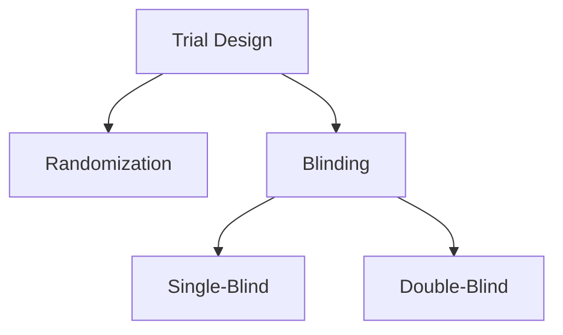
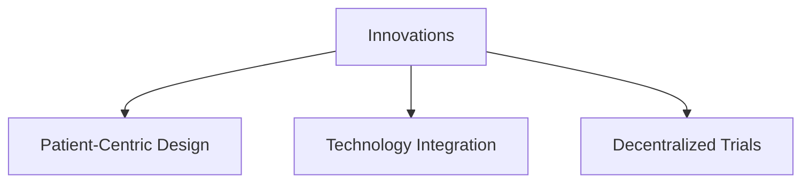

# Module 5: Overview of a Protocol and Designing a Clinical Trial

## **Overview**
The design of a clinical trial and the protocol guiding it are the foundation of any successful study. The protocol ensures the trial's objectives are met while maintaining scientific integrity and protecting participant safety. This module delves into the essential components of a clinical trial protocol, the design process, and key considerations in creating robust trials that adhere to ethical and regulatory standards.

---

## **Learning Objectives**

By the end of this module, you should be able to:
1. Explain the purpose and structure of a clinical trial protocol.
2. Identify key elements involved in trial design.
3. Discuss the importance of statistical methods and ethical considerations.
4. Highlight the role of regulatory requirements in protocol development.

---

## **What is a Clinical Trial Protocol?**

A protocol is a comprehensive document that outlines the objectives, methodology, and operational framework for a clinical trial. It ensures:
- Consistency in study execution.
- Participant safety and ethical compliance.
- Accurate and reliable data collection for analysis.

---

## **Key Components of a Protocol**

1. **Study Objectives**  
   - Primary objectives: Define the main aim (e.g., efficacy, safety).  
   - Secondary objectives: Additional data collection points.  

2. **Study Design**  
   - Describes the structure and methodology of the trial.  
   - Includes randomization, blinding, and treatment arms.  

3. **Eligibility Criteria**  
   - Defines inclusion and exclusion criteria for participants.  
   - Ensures homogeneity in study populations.  

4. **Intervention Plan**  
   - Specifies the drug, device, or procedure under investigation.  
   - Includes dosing schedules and administration methods.  

5. **Outcome Measures**  
   - Primary outcomes: Core metrics of success or failure.  
   - Secondary outcomes: Additional measures of interest.  

6. **Statistical Analysis**  
   - Outlines data analysis techniques to ensure validity and reliability.  

7. **Safety Monitoring**  
   - Details adverse event reporting and management procedures.  

---

## **Designing a Clinical Trial**

### **1. Study Types**
- **Randomized Controlled Trials (RCTs)**: Gold standard for assessing interventions.
- **Observational Studies**: Examine outcomes without intervention.
- **Adaptive Trials**: Modify aspects based on interim results.

### **2. Randomization**
- Reduces bias and ensures comparable treatment groups.

### **3. Blinding**
- **Single-Blind**: Only participants are unaware of treatment groups.  
- **Double-Blind**: Both participants and investigators are unaware.  

---

### **4. Statistical Considerations**
- Sample size calculations ensure adequate power.
- Hypothesis testing assesses the significance of findings.
- Interim analyses provide early insights while maintaining trial integrity.

---

## **Ethical Considerations**

1. **Informed Consent**  
   - Participants must be fully aware of the study details, risks, and benefits.

2. **Risk-Benefit Analysis**  
   - Ensures risks are minimized and benefits justify participation.

3. **Oversight by Institutional Review Boards (IRBs)**  
   - IRBs review and approve protocols to safeguard participant rights.

---

## **Regulatory Considerations**

1. **FDA and ICH Guidelines**  
   - Ensure adherence to Good Clinical Practice (GCP).  

2. **ClinicalTrials.gov Registration**  
   - Mandatory for transparency and public access to trial information.  

3. **Adverse Event Reporting**  
   - Strict timelines and procedures for reporting to regulatory authorities.

---

## **Challenges in Protocol Development**

- Balancing scientific rigor with practical feasibility.
- Addressing potential recruitment and retention issues.
- Navigating complex regulatory landscapes.

---

## **Solutions and Innovations**

1. **Patient-Centric Design**  
   - Engage participants in trial design for improved relevance and retention.

2. **Use of Technology**  
   - Electronic data capture (EDC) systems streamline documentation.  
   - Wearables and mobile apps enhance real-time monitoring.  

3. **Decentralized Trials**  
   - Reduce barriers to participation by allowing remote data collection.

---

## **Summary**

The clinical trial protocol is a vital tool for ensuring a study’s success. By adhering to ethical standards, leveraging advanced statistical methods, and incorporating innovative technologies, researchers can design trials that are both scientifically rigorous and participant-friendly. Collaboration among stakeholders and compliance with regulatory guidelines are critical to overcoming challenges in protocol development.
