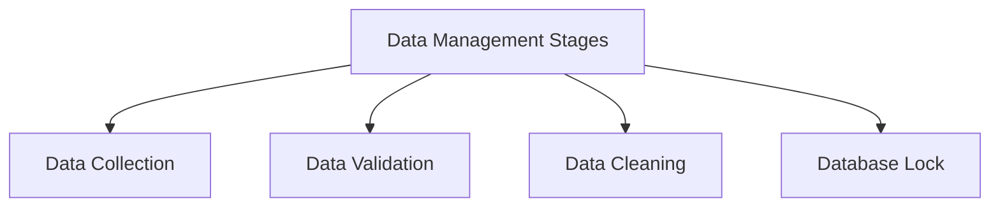
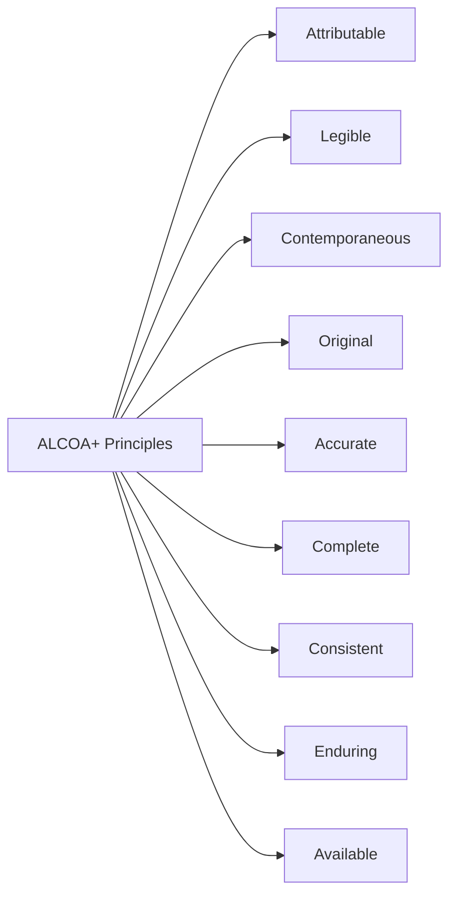
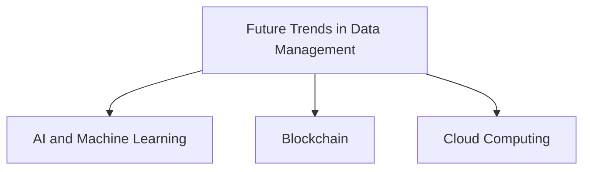

# Module 6: Data Management in Clinical Research

#### **Overview**
Data management plays a critical role in clinical research, ensuring the accuracy, integrity, and reliability of collected data. This module focuses on the key principles, tools, and techniques used to manage clinical data effectively, emphasizing compliance with regulatory requirements and the importance of high-quality data.

---

### **Learning Objectives**
By the end of this module, you should be able to:
1. Describe the stages of clinical data management.
2. Understand the principles of data quality and integrity.
3. Identify common tools and technologies used in clinical data management.
4. Discuss the importance of regulatory compliance in data handling.

---

### **Key Topics**

#### **1. Stages of Clinical Data Management**
Data management involves several key stages:
- **Data Collection**
  - Collection methods include case report forms (CRFs), electronic health records (EHRs), and wearable devices.
  - Tools like electronic data capture (EDC) systems streamline the process.
- **Data Validation**
  - Ensures consistency and accuracy of the data.
  - Involves automated checks and manual reviews.
- **Data Cleaning**
  - Identifies and resolves discrepancies, missing entries, and errors.
- **Database Lock**
  - Data is finalized for analysis, ensuring no further changes can be made.

---

#### **2. Data Quality and Integrity**
Data quality and integrity are critical to the success of clinical research:
- **ALCOA+ Principles**: Attributable, Legible, Contemporaneous, Original, Accurate, Complete, Consistent, Enduring, Available.
- **Audit Trails**: Logs that track changes to the data, ensuring accountability.
- **Standard Operating Procedures (SOPs)**: Ensure consistency in data handling.

---

#### **3. Tools and Technologies**
Modern tools and technologies enhance efficiency in data management:
- **Electronic Data Capture (EDC) Systems**
  - Examples: REDCap, Medidata Rave.
  - Enable real-time data entry and validation.
- **Clinical Trial Management Systems (CTMS)**
  - Track trial progress and manage study logistics.
- **Data Warehousing**
  - Centralized storage for large datasets.
- **Artificial Intelligence (AI)**
  - Detects anomalies and automates data cleaning.

---

#### **4. Regulatory Compliance**
Compliance with regulations ensures ethical and legal handling of data:
- **Good Clinical Practice (GCP)**
  - Guidelines for data collection and management.
- **HIPAA (Health Insurance Portability and Accountability Act)**
  - Protects patient data privacy and security.
- **General Data Protection Regulation (GDPR)**
  - Governs data protection in the European Union.

---

### **Challenges in Data Management**
- **Data Volume**
  - Handling massive datasets from multiple sources.
- **Data Security**
  - Protecting against breaches and ensuring data privacy.
- **Standardization**
  - Ensuring compatibility between different data formats and systems.
- **Real-Time Monitoring**
  - Leveraging technology for continuous data review.

---

### **Future Trends**
- **AI and Machine Learning**
  - Predictive analytics and anomaly detection.
- **Blockchain**
  - Enhances data security and traceability.
- **Cloud Computing**
  - Scalable storage solutions for global collaboration.

---

### **Conclusion**
Data management is the backbone of clinical research, ensuring that the information collected is reliable, secure, and ready for analysis. By adhering to principles of data quality, leveraging modern technologies, and maintaining regulatory compliance, clinical research can achieve its goals of improving healthcare outcomes and advancing medical science.
