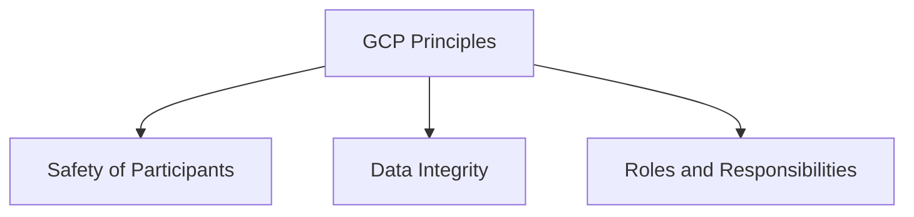
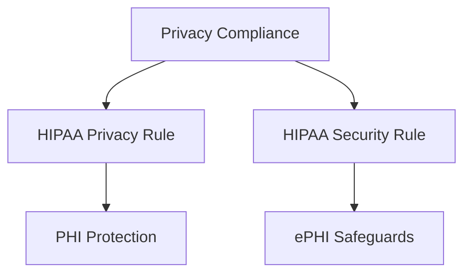
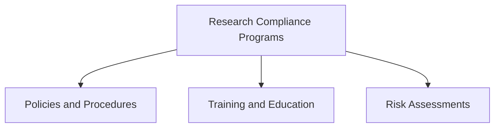
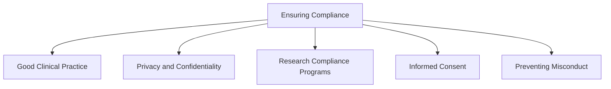
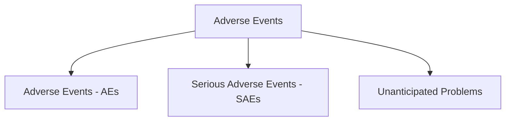

### Module 7: Ensuring Compliance in Clinical Research

#### Content Author

**Kelly Willenberg, DBA, MBA**  
*Kellly Willenberg & Associates*

---

## Overview

Ensuring compliance in clinical research safeguards the rights, safety, and well-being of human participants. Compliance integrates ethical principles with regulatory frameworks, reducing risks, preventing misconduct, and ensuring data integrity. This module covers key areas of compliance, including Good Clinical Practice (GCP), privacy standards like HIPAA, research compliance programs, and strategies for preventing research misconduct.

---

## Learning Objectives

By the end of this module, you should be able to:

1. Discuss the role of compliance in protecting research participants.
2. Identify the core principles of GCP and their applications.
3. Understand privacy and confidentiality standards, including HIPAA regulations.
4. Describe essential elements of research compliance programs.
5. Recognize and prevent research misconduct.

---

## Key Components of Compliance

### 1. **Good Clinical Practice (GCP)**

- **Definition**: GCP is an international quality standard ensuring the ethical and scientific integrity of clinical trials involving human participants.
- **Core Principles**:  
  1. Protecting participants' safety and rights.  
  2. Ensuring reliable and credible trial data.  
  3. Defining roles and responsibilities for sponsors, investigators, and IRBs.

#### Compliance vs. Competency

- **Compliance**: Meeting the basic GCP requirements.
- **Competency**: Demonstrating deeper understanding and skill in applying GCP principles effectively.

---

### 2. **Privacy and Confidentiality Standards**

#### **HIPAA Compliance**

- **Privacy Rule**: Protects individuals' Protected Health Information (PHI) across all mediums.
- **Security Rule**: Ensures confidentiality, integrity, and availability of electronic PHI (ePHI).

#### Key Practices

- Use de-identified data or limited data sets when possible.
- Implement robust administrative, technical, and physical safeguards.

---

### 3. **Research Compliance Programs**

#### Components

- **Policies and Procedures**: SOPs to establish roles, responsibilities, and guidelines.
- **Training and Education**: GCP-focused training for competency development.
- **Risk Assessments**: Identifying vulnerabilities and mitigating risks proactively.

---

### 4. **Informed Consent**

Informed consent is a continuous communication process, not merely a form-signing activity. Key elements include:

1. Disclosing all relevant information for informed decision-making.
2. Ensuring participants understand the information.
3. Highlighting voluntary participation.

#### Challenges

- Avoiding coercion or undue influence.
- Addressing language and literacy barriers.

---

## Addressing Misconduct in Research

### Types of Misconduct

1. **Falsification**: Altering or misrepresenting data.
2. **Fabrication**: Creating false data or results.
3. **Plagiarism**: Using others’ ideas or work without credit.

#### Preventative Measures

- Conduct regular audits.
- Establish confidential reporting mechanisms.
- Promote a culture of ethical responsibility.

---

## Reporting and Monitoring

### Safety Reporting

Timely reporting of adverse events (AEs) and unanticipated problems is critical for participant safety.

#### Adverse Event Types

1. **Adverse Events (AEs)**: Any negative medical occurrence during the trial.
2. **Serious Adverse Events (SAEs)**: Life-threatening or hospitalization-requiring events.
3. **Unanticipated Problems**: Risks that were not foreseen but impact participant safety.

---

## Visualizing Key Compliance Elements

### Compliance Ecosystem

### Adverse Event Reporting

---

## Challenges in Ensuring Compliance

1. Managing vast regulatory requirements.
2. Navigating global differences in compliance standards.
3. Ensuring ethical consistency across multi-center trials.

---

## Conclusion

Compliance in clinical research ensures participant safety, ethical integrity, and high-quality data. By adhering to GCP principles, maintaining privacy and confidentiality, and proactively addressing potential risks, researchers can uphold the highest standards of research integrity and advance public health.

---
