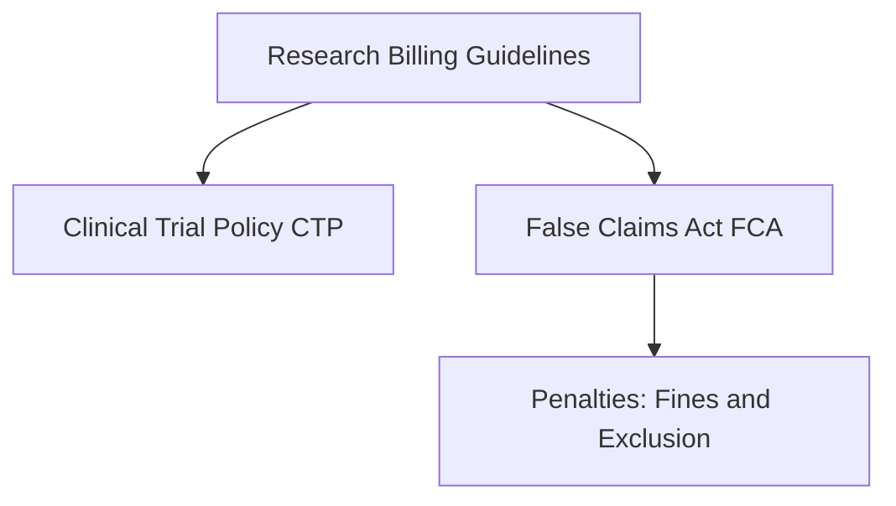
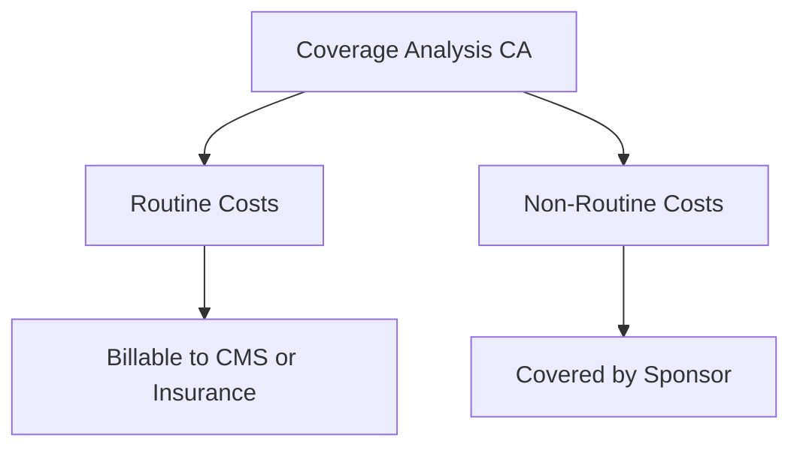
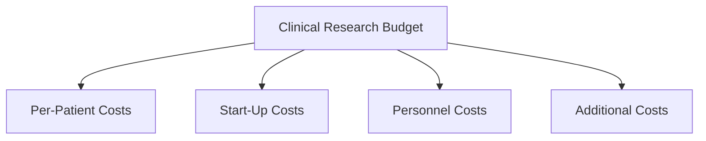
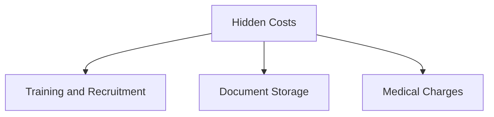
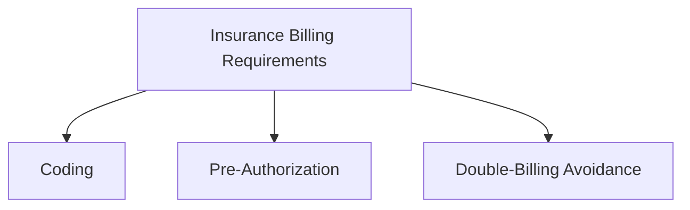
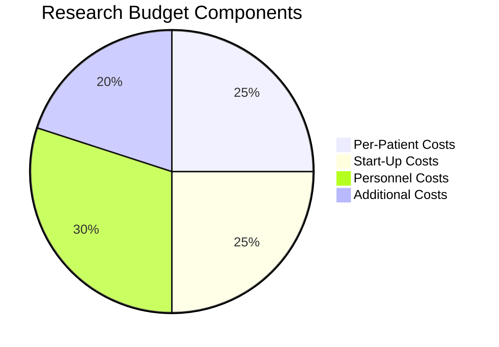
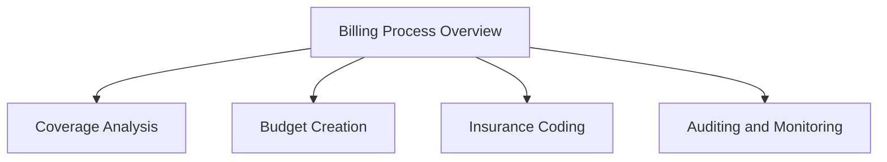

# Module 8: Overview of Clinical Budgeting and Billing in Research (ID 20470)

## Content Author
**Marie Jackson, PhD, MBA**  
Methodist le Bonheur Healthcare  

---

## Introduction

Clinical research sites must understand and manage the costs associated with conducting trials to sustain their research portfolio and deliver new therapies to patients. This module explores the critical processes of clinical trial budgeting and billing, including compliance with federal guidelines, managing research costs, and ensuring proper billing practices.

---

## Learning Objectives

By the end of this module, you will be able to:
- Understand the Centers for Medicare & Medicaid Services (CMS) guidelines and rules for research billing.
- Discuss the risks of incorrect billing and compliance with the False Claims Act (FCA).
- Explain the purpose and components of a Coverage Analysis (CA).
- Outline the components of a clinical research budget.
- Identify potential hidden costs in clinical trials.
- Understand insurance billing requirements, including coding and pre-authorization.

---

## Key Concepts and Details

### 1. **Guidelines and Rules for Research Billing**
Federal guidelines such as the Clinical Trial Policy (CTP), National Coverage Determination (NCD 310.1), and the False Claims Act (FCA) govern research billing to ensure compliance.

#### **Clinical Trial Policy (CTP)**
- Introduced in 2000, revised in 2007.
- Authorizes payment for routine patient care costs associated with clinical trials.

#### **False Claims Act (FCA)**
- Imposes liability for knowingly submitting false claims to government programs.
- Penalties include fines up to three times the claim value and exclusion from federal funding.

---

### 2. **Coverage Analysis (CA)**
The CA identifies all items or services within a clinical study and assigns responsibility for payment (e.g., CMS, sponsor, or insurance). It ensures proper segregation of charges and prevents double billing.

#### **Goals of a CA**
- Determine billing qualifications.
- Allocate costs to the correct payer.
- Provide documentation justification for third-party billing.

#### **Routine Costs vs. Non-Routine Costs**
- **Routine Costs**: Items/services required for investigational drugs, monitoring effects, or treating complications.
- **Non-Routine Costs**: Items provided solely for data collection or covered by the sponsor.

---

### 3. **Clinical Research Budget**
A clinical research budget covers all costs associated with the study, including per-patient, start-up, personnel, and additional costs.

#### **Key Components**
1. **Per-Patient Costs**: Tests, procedures, pharmacy, laboratory fees.
2. **Start-Up Costs**: IRB fees, regulatory document preparation, CA creation.
3. **Personnel Costs**: Investigator, coordinator, and data management team time.
4. **Additional Costs**: Screen failures, unscheduled visits, data queries, and overhead.

---

### 4. **Hidden Costs in Research**
Sites often face hidden costs that are overlooked during budgeting, such as:
- Training (e.g., Good Clinical Practice, electronic data capture).
- Recruitment and advertising.
- Long-term document storage.
- Additional medical charges (e.g., sedation, infusion tubing).

#### **Example**
An EKG listed in the protocol may require triplicate testing, increasing costs beyond what is outlined in the study calendar.

---

### 5. **Insurance Billing Requirements**
Proper insurance billing is critical to avoid compliance violations.

#### **Key Requirements**
- **Coding**: Use National Clinical Trial (NCT) numbers, modifiers (e.g., Q1, Q0), and condition codes (e.g., 30, 53).
- **Pre-Authorization**: Ensure payer-specific approvals for procedures.
- **Double-Billing Avoidance**: Prevent billing the same service to both sponsors and insurers.

---

### 6. **Routine Audits**
Regular billing audits are essential to identify errors early and ensure compliance. Audits compare the study enrollment log, billing system, and sponsor invoices against the CA grid.

---

## Summary

Proper budgeting and billing practices are essential to sustain clinical research. Key strategies include:
- Adhering to CMS and FCA guidelines.
- Using a detailed CA grid to allocate costs.
- Accounting for hidden costs.
- Synchronizing documents and conducting routine audits.

By following these practices, sites can ensure compliance, reduce risks, and effectively manage clinical trial costs.

---

## Visual Chart of Research Budget Components

This chart represents the key components of a clinical research budget.

This flowchart outlines the major steps in the clinical trial billing process.

### Case Study: Oncology Clinical Trial

In an oncology clinical trial, the CA grid identified MRI scans as routine costs billable to insurance under NCD 220.2. The site prevented double-billing by assigning sponsor-paid services (e.g., study drug infusion) to a separate account. Routine audits revealed a missing CPT code, which was corrected to ensure timely reimbursement.