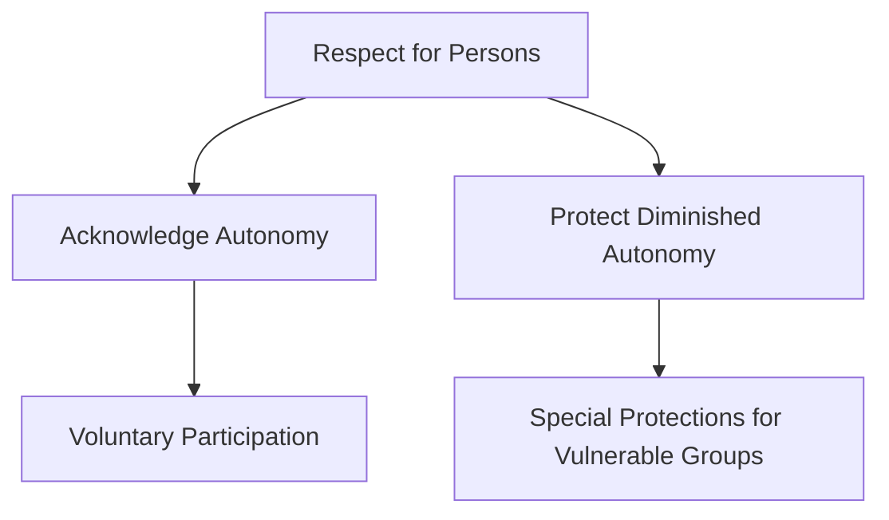
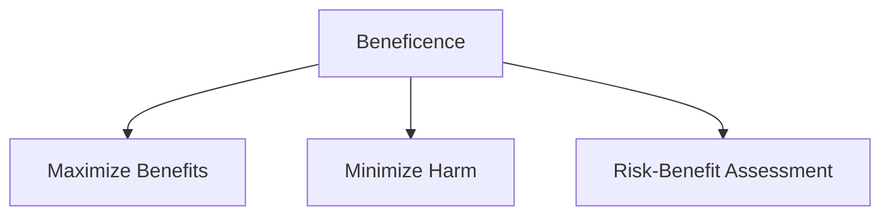
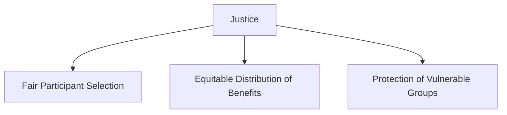
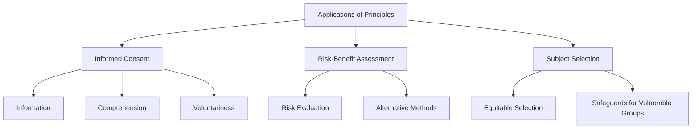
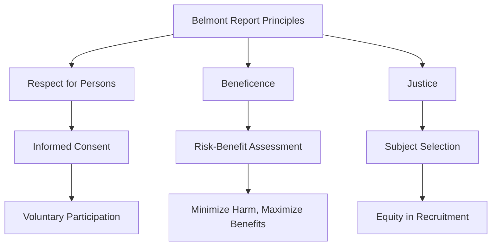

# Summary: The Belmont Report Principles in Clinical Research

The **Belmont Report**, published in 1979, provides a framework of ethical principles guiding biomedical and behavioral research involving human subjects. It emphasizes three key principles—Respect for Persons, Beneficence, and Justice—to ensure the protection and ethical treatment of research participants. Below is a detailed summary, incorporating visual aids for clarity.

---

## **Part 1: Overview of Ethical Principles**

### 1. **Respect for Persons**
- Individuals are autonomous agents.
- Special protection is given to those with diminished autonomy (e.g., minors, individuals with cognitive impairments).
- Researchers must:
  - Obtain **voluntary informed consent** from participants.
  - Provide sufficient information to allow autonomous decision-making.

### 2. **Beneficence**
- **Do no harm** and maximize potential benefits.
- Researchers must assess and minimize risks.
- Balance risks against potential societal and individual benefits.

### 3. **Justice**
- Fair distribution of research benefits and burdens.
- Avoid exploitation of vulnerable populations (e.g., economically disadvantaged individuals, racial minorities).
- Researchers must:
  - Ensure equitable selection of participants.
  - Justify the inclusion of vulnerable groups.

---

## **Part 2: Application of Principles**

### **1. Informed Consent**
- Central to **Respect for Persons**.
- Includes three essential elements:
  1. **Information**: Participants must receive sufficient details about the research (e.g., purpose, procedures, risks, and benefits).
  2. **Comprehension**: Information must be conveyed in a way that participants can understand.
  3. **Voluntariness**: Participation must be free of coercion or undue influence.

### **2. Assessment of Risk and Benefits**
- Integral to **Beneficence**.
- Researchers must:
  - Evaluate all potential risks and benefits.
  - Consider alternative methods to minimize harm.
- Systematic analysis ensures ethical justification for the research.

### **3. Selection of Subjects**
- Reflects **Justice**.
- Ensures that:
  - Participants are selected equitably.
  - Vulnerable groups are involved only when necessary and with additional safeguards.

---

## **Summary Chart**

By understanding and applying the Belmont principles, researchers can uphold ethical standards and ensure the protection of human subjects in clinical research.
