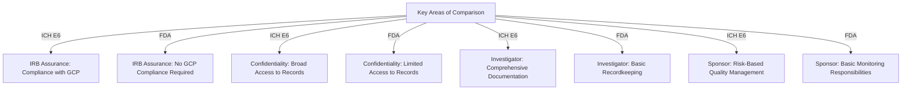
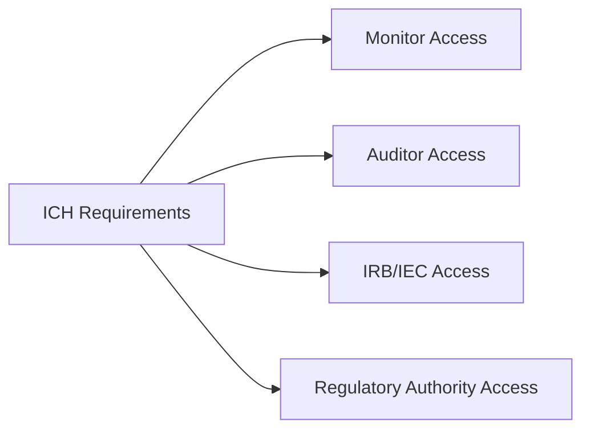
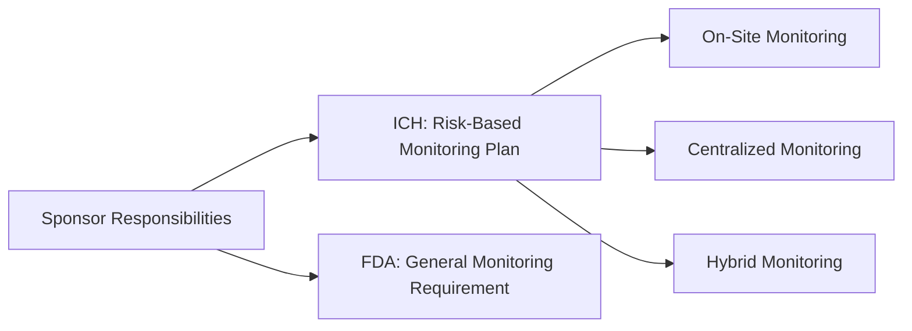

### Module 10: ICH—Comparison Between ICH GCP E6 and U.S. FDA Regulations (ID 14625) - Part 1

#### Introduction: What is ICH?
The International Council for Harmonisation (ICH) aims to streamline the process for developing and marketing new drugs internationally. It includes representatives from pharmaceutical industries and regulatory bodies from various countries, such as the U.S., Japan, the European Union, Switzerland, and Canada. Observers include representatives from Brazil, China, South Korea, the World Health Organization, and others.

ICH provides several international standards of Good Clinical Practice (GCP) for pharmaceutical development. A significant guideline is ICH (2016) E6—**"Integrated Addendum to ICH E6(R1): Guideline for Good Clinical Practice E6(R2)."**

The initial model for drafting ICH E6 was the U.S. FDA regulations for the protection of human subjects (21 CFR 50 and 21 CFR 56). The first version (E6(R1)) was finalized in 1996, with the current E6(R2) implemented in 2016 to address globalization, study complexity, and technological advancements.

#### Learning Objectives
By the end of this module, you should be able to:
- Describe the legal status of ICH in the U.S.
- Identify important differences between ICH guidelines and U.S. FDA regulations.

#### Legal Status of ICH
ICH E6 serves as guidance in the U.S. but does not carry the force of law. Compliance with ICH E6 is voluntary, but adherence ensures international acceptance of trial data.

#### Key Differences Between ICH E6 and U.S. FDA Regulations (21 CFR 50 and 56)
The ICH E6 guideline aligns closely with FDA regulations for IRBs, investigators, and informed consent but includes requirements that extend beyond FDA standards.

---

### Key Differences Overview

---

### IRB Assurance of Compliance with GCP
- **ICH E6 Requirement:**
  - ICH (Section 5.11) mandates that the sponsor obtain a statement from the IRB ensuring it operates according to GCP standards.
  - Sponsors may approach the IRB directly or require the investigator to forward the assurance.

- **FDA Regulation:**
  - No such GCP compliance assurance is required.

---

### Confidentiality of Medical Records
- **ICH E6 Requirement:**
  - Broad access is granted to research records and medical records for monitoring, auditing, and regulatory inspections.
  - Informed consent must disclose this access to subjects.

- **FDA Regulation:**
  - Requires only limited confidentiality disclosures.

---

### Investigator Responsibilities
- **ICH E6:**
  - Comprehensive recordkeeping, including detailed and traceable source documents.
  - Requires medical care to be overseen by a qualified physician or dentist.

- **FDA:**
  - Basic recordkeeping requirements without emphasis on traceability.
  - No explicit requirement for medical oversight by a qualified professional.

---

### Sponsor Responsibilities
- **ICH E6:**
  - Emphasizes a risk-based quality management system.
  - Requires sponsors to ensure oversight even when delegating responsibilities to a CRO.

- **FDA:**
  - Monitoring and delegation responsibilities are less detailed.

---
### Module 10: ICH—Comparison Between ICH GCP E6 and U.S. FDA Regulations (ID 14625) - Part 2

#### Sponsor Monitoring Responsibilities
- **ICH E6 Requirement:**
  - ICH (Section 5.18) requires systematic, prioritized risk-based monitoring. Sponsors must document monitoring plans tailored to specific trial risks.
  - Monitoring may include on-site, centralized, or hybrid approaches with clear documentation.

- **FDA Regulation:**
  - FDA regulations (21 CFR 312.50) state that sponsors must ensure proper monitoring but lack specific monitoring strategy requirements.

---

### Record Retention Requirements
- **ICH E6 Requirement:**
  - Sponsors must retain essential documents for at least two years after the last marketing approval in ICH regions. If clinical development is discontinued, records must be kept for at least two years post-discontinuation.

- **FDA Regulation:**
  - Records should be retained for two years after drug shipment and delivery cease if no marketing application is approved.

---

### Signature and Documentation of Consent
- **ICH E6:**
  - Consent forms must include signatures from the subject (or legally acceptable representative) and the person conducting the consent discussion.
  - Documentation of the consent process should be included in medical records.

- **FDA:**
  - Only the subject’s signature is required.

---

### Assent for Vulnerable Populations
- **ICH E6:**
  - Requires assent from adults with decisional impairments unless specific exceptions apply.

- **FDA:**
  - Does not specifically address assent from incapacitated adults.

---

### Emergency Situations
- **ICH E6:**
  - Provides guidelines for enrolling subjects without consent during emergencies, with specific measures to protect subject rights and safety.

- **FDA:**
  - Allows exceptions for informed consent in emergencies under defined conditions (e.g., life-threatening scenarios).

---

### Elements of Consent
#### Key Additions in ICH E6 Compared to FDA Regulations
1. **Alternative Treatments:**
   - ICH requires a discussion of potential benefits and risks of alternative treatments.
2. **Study Arm Probability:**
   - Requires consent forms to include probabilities for random assignment to study arms.
3. **Subject Responsibilities:**
   - Must outline the subject’s responsibilities during the trial.
4. **Prorated Payment:**
   - Includes anticipated payment structure to avoid undue influence.

---

#### Summary
Compliance with ICH E6 guidelines ensures global acceptability of trial data, enhances participant protection, and strengthens the integrity of clinical research. Although voluntary in the U.S., adherence to ICH E6 is often mandated by sponsors to meet international standards.

Researchers and IRBs must be aware of the distinctions between FDA regulations and ICH guidelines to ensure appropriate compliance where required.
