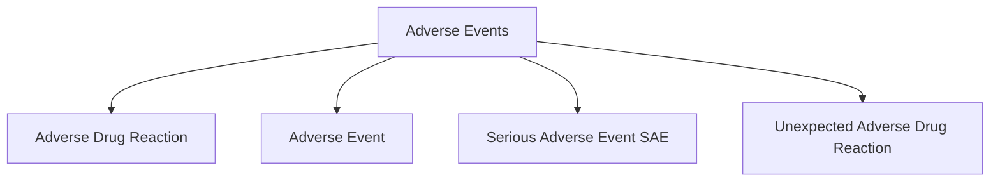
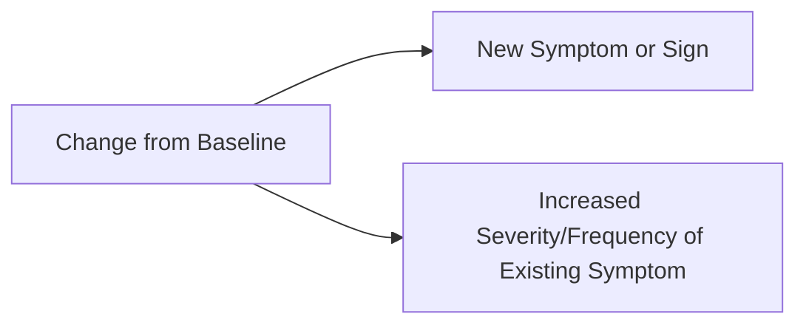
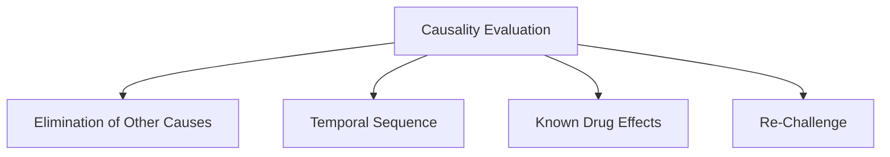

### Module 11: Detecting and Evaluating Adverse Events (ID 14623) - Part 1

#### Introduction
One objective of clinical research is to determine investigational product safety. Researchers and sponsors record and analyze adverse events (AEs) during the trial. These data are critical to the process of obtaining approval to market a new product and form the basis for the product's labeling (package insert).

This module reviews AE terminology, steps to investigate and detect AEs, and factors to assess their severity and causality.

**Learning Objectives:**

By the end of this module, you should be able to:

1. Define AEs and related terminology for clinical trials.
2. Describe the process for identifying AEs in clinical research.
3. Identify factors to consider in assessing the severity and causality of AEs.

#### Definitions
- **Adverse Drug Reaction (ADR):** A noxious and unintended response to a medicinal product related to any dose where a causal relationship is at least a reasonable possibility (ICH 2016).
- **Adverse Event (AE):** Any untoward medical occurrence in a patient administered a pharmaceutical product, whether related or not to the product.
- **Serious Adverse Event (SAE):** Includes events such as death, life-threatening situations, hospitalization, significant disability, or congenital anomalies (ICH 2016).
- **Unexpected Adverse Drug Reaction:** Adverse reaction inconsistent with product information (ICH 2016).



#### Detecting Adverse Events
Adverse events can be detected through direct observations, laboratory reports, or subject reports. Investigators are responsible for identifying and classifying AEs, though this can be delegated to trained staff.

**Examples of AE Detection:**
- **Direct Observation:** Rash during a physical exam.
- **Laboratory Reports:** Abnormal test results.
- **Subject Reports:** Symptoms like headaches or nausea.

**Subjective vs. Objective Data Collection:**
- **Objective:** Measurable data (e.g., lab results).
- **Subjective:** Patient-reported symptoms (e.g., nausea).

#### Change from Baseline
Changes in a subject's condition can constitute an AE if:

1. A new symptom or sign appears.
2. An existing symptom's severity or frequency increases.



#### Sources of Information About AEs
1. **Direct Observations**
2. **Laboratory Reports**
3. **Other Medical Reports**
4. **Subject Diaries**
5. **Subject Reports**

#### Treating Adverse Events
Treatment for AEs is often guided by protocol-specific guidelines. For example:
- Corticosteroid therapy for rash.
- Dose reduction if neutrophil count falls below a specified level.

#### Recording Adverse Events
Once identified, AEs are recorded and reported per sponsor and regulatory requirements. Categories for recording AEs include:

- **Body System:** Organizing AEs by body system (e.g., gastrointestinal).
- **Severity:** Graded as mild, moderate, or severe.
- **Terminology:** Using consistent and protocol-specific terms.

```mermaid
graph TD
    A[Recording Adverse Events] --> B[Categorize by Body System]
    A --> C[Determine Severity]
    A --> D[Use Protocol Terminology]


````

### Module 11: Detecting and Evaluating Adverse Events (ID 14623) - Part 2

#### Categorizing Adverse Events
AEs should be categorized to maintain consistency and ensure accurate reporting. Sponsors provide protocols for specific categorizations.

**Key Considerations:**
1. **Standard Terminology:** Avoid vague terms like "butterflies in the stomach." Use precise terms such as "anxiety" or "nausea."
2. **Individual Signs vs. Grouping:** Record symptoms individually or as a syndrome based on sponsor guidelines.
3. **Distinguishing AEs from Disease:** Separate AEs from symptoms of the condition being studied.

#### Determining Severity of Adverse Events
Severity refers to the intensity of the AE, graded as:

| Grade | Description |
|-------|-------------|
| None  | No signs or symptoms. |
| Mild  | Symptoms are easily tolerated. |
| Moderate | Interferes with daily activities. |
| Severe | Incapacitating symptoms. |
| Life-Threatening | Requires intensive care or invasive procedures. |
| Fatal | Results in death. |
---

```mermaid
graph LR
    A[Severity Levels] --> B[Mild]
    A --> C[Moderate]
    A --> D[Severe]
    A --> E[Life-Threatening]
    A --> F[Fatal]

  

```

#### Evaluating Adverse Events
Evaluating AEs involves examining:
1. **Severity:** As described in the table above.
2. **Seriousness:** Determines if an event requires immediate reporting.
3. **Causality:** Assesses whether the AE is linked to the investigational agent.

#### Determining Causality
Causality evaluation considers:
- **Elimination of Other Causes:** Rule out other drugs, treatments, or environmental factors.
- **Temporal Sequence:** Examine timing of AE relative to drug administration.
- **Known Drug Effects:** Reference Investigator's Brochure (IB) for expected side effects.
- **Re-Challenge:** If the AE resolves upon stopping the drug and recurs upon re-administration, it is likely related to the investigational agent.



#### Categories of Causality
Sponsors often use these categories:
- **Definitely Related:** Certain that the investigational product caused the AE.
- **Probably Related:** High likelihood of causation.
- **Possibly Related:** Cannot rule out causation.
- **Unlikely to Be Related:** Less likely to be related.
- **Unrelated:** Evidence suggests no connection.

#### Case Study
In a phase III study, a subject develops symptoms after taking the study drug. To determine severity and causality:
1. Document onset and resolution of symptoms.
2. Compare to expected side effects.
3. Conduct a re-challenge to confirm causation.

#### Summary
Investigators must ensure:
- Adverse events are accurately recorded.
- Severity and causality assessments follow protocol requirements.
- Proper documentation and regulatory reporting are maintained to ensure trial integrity.
