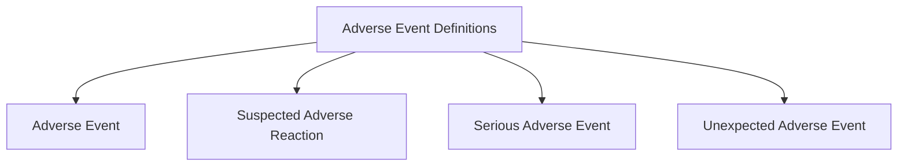
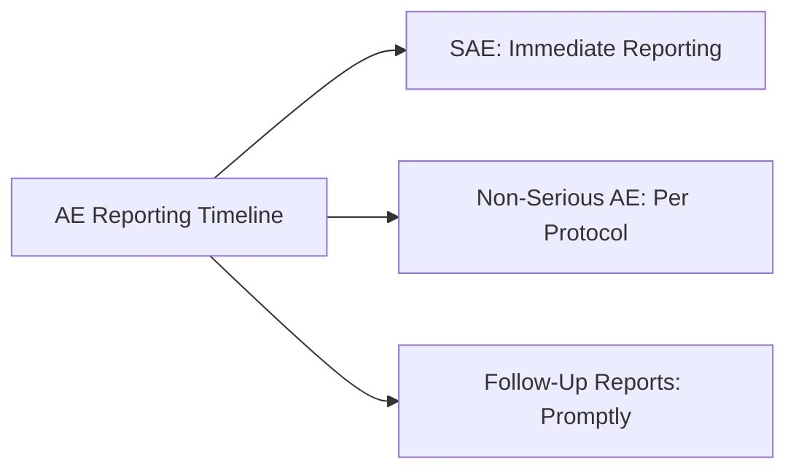
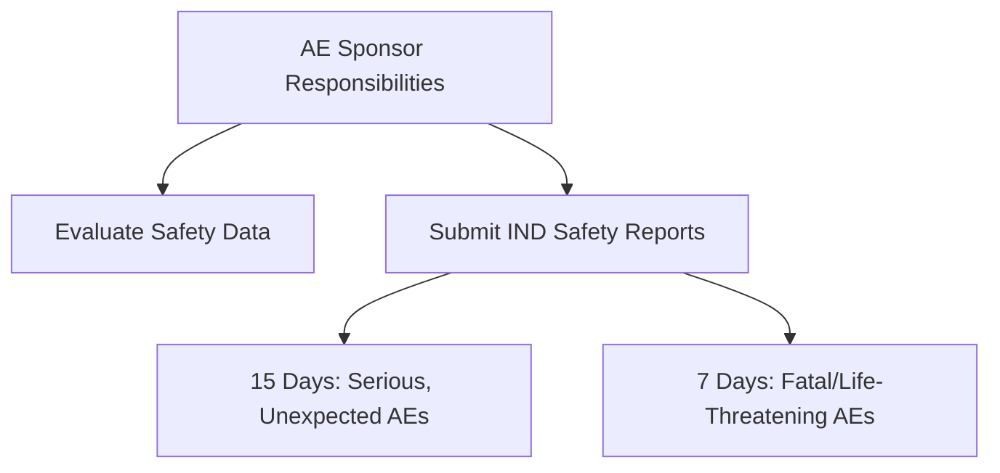
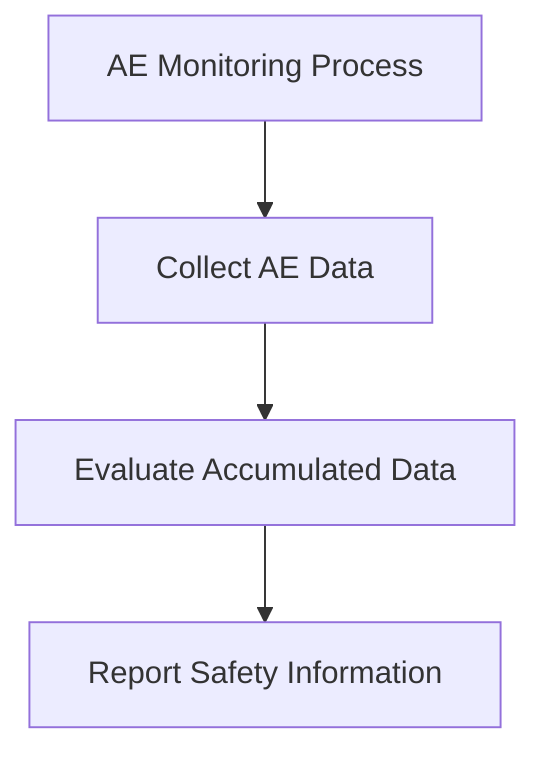
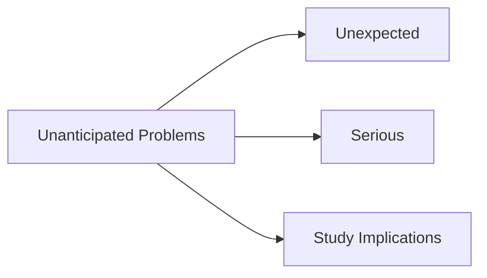

### Module 12: Reporting Serious Adverse Events in Investigations of Drugs and Biologics (ID 14624) - Part 1

#### Introduction
Clinical trials aim to gather safety data on investigational products. Reporting adverse events (AEs) is essential for ensuring safety and regulatory compliance. Investigators and sponsors are required to evaluate and report AEs to regulatory bodies, primarily the U.S. Food and Drug Administration (FDA).

**Note:** This module refers to the revised ICH E6(R2) guideline unless otherwise specified.

#### Learning Objectives
By the end of this module, you should be able to:
- Define the categories of AEs and their reporting requirements.
- Describe investigator reporting responsibilities.
- Explain sponsor actions for AE reporting to the FDA or other regulatory authorities.

---

#### Definitions

---

- **Adverse Event (AE):** Any untoward medical occurrence associated with a drug in humans, whether or not related to the drug (ICH 2016, 21 CFR 312).
- **Suspected Adverse Reaction:** Any AE with a reasonable possibility of being caused by the drug, implying some evidence for causality (21 CFR 312).
- **Serious Adverse Event (SAE):** Events resulting in death, life-threatening conditions, hospitalization, incapacity, or congenital anomalies (ICH 2016, 21 CFR 312).
- **Unexpected Adverse Event:** An event not consistent with the investigator brochure or general investigational plan (21 CFR 312).

---

#### Classifying Adverse Events
AEs are classified based on their severity and unexpected nature:

- **Life-Threatening AE:** Poses an immediate risk of death.
- **Serious AE:** Meets criteria for hospitalization, incapacity, or severe outcomes.
- **Unexpected AE:** Severity or specificity exceeds known data in the investigator’s brochure.

#### Investigator Reporting Requirements

**What to Report:**
- All AEs and laboratory abnormalities, including both serious and non-serious events.
- SAEs must include an assessment of the likelihood of causation by the investigational drug.

**When to Report:**
- **SAEs:** Report immediately (industry standard: within 24 hours) to the sponsor.
- **Non-Serious AEs:** Report as specified in the study protocol.

---

#### Examples of AE Reporting

1. **Serious and Unexpected Event:**
   - Subject experiences a cardiac event requiring hospitalization.
   - **Action:** Investigator reports immediately to sponsor.

2. **Non-Serious and Expected Event:**
   - Subject reports nausea listed in the investigator’s brochure.
   - **Action:** Investigator reports according to protocol schedule.

---

#### ICH E2A Guideline
ICH E2A provides detailed reporting requirements for fatal or life-threatening adverse drug reactions. Reporting timelines include:
- **Fatal/Life-Threatening AEs:** Report within 7 calendar days.
- **Other Serious AEs:** Report within 15 calendar days.

#### Reporting Study Endpoints and Subject Deaths
- Report study endpoints as per protocol unless causally linked to the drug.
- For subject deaths, provide additional information like autopsy or terminal medical reports to the sponsor and IRB/IEC.

---

#### Sponsor Monitoring and Reporting Requirements
Sponsors must:
- Continuously evaluate the safety data of investigational products.
- Promptly report significant findings to regulatory authorities.

**Sponsor Reporting Requirements:**
- Notify investigators and regulatory bodies within 15 days for serious, unexpected, and drug-related AEs.
- Fatal or life-threatening AEs must be reported within 7 days.

---
### Module 12: Reporting Serious Adverse Events in Investigations of Drugs and Biologics (ID 14624) - Part 2

#### Monitoring and Reporting Requirements for Sponsors

According to ICH (2016), the sponsor is responsible for monitoring AE data from investigators and other sources to identify new safety information.

**Steps for Monitoring:**
1. Collect AE data from investigators, laboratories, and other sources.
2. Evaluate accumulated data to identify new risks.
3. Report safety information promptly to regulators and investigators.

**Key Sponsor Reporting Timelines:**
- **Serious and Unexpected AEs:** Notify FDA and investigators within 15 days.
- **Fatal or Life-Threatening AEs:** Notify FDA and investigators within 7 days.

#### Differences in Reporting to Sponsors vs. IRBs

The rationale for reporting differs for sponsors and IRBs:
- **To Sponsors:** For evaluating the investigational product's safety profile.
- **To IRBs:** For assessing trial risks and subject safety.

**Unanticipated Problems:**
Unanticipated problems must meet the following criteria:
1. Unexpected
2. Serious
3. Have implications for the conduct of the study

Examples include:
- Single occurrence of a rare, serious AE associated with drug exposure.
- Higher-than-expected incidence rates of AEs.

#### Bioavailability (BA) and Bioequivalence (BE) Studies

BA and BE studies require safety reporting even when exempt from IND requirements:
- **SAEs:** Report within 15 days.
- **Fatal or Life-Threatening Events:** Report within 7 days.

#### Clinical Trials Involving Marketed Drugs

In cases where a drug is marketed in some countries but under investigation in others:
- Follow post-marketing safety reporting requirements.
- Ensure compliance with the relevant country’s regulations.

#### Blinded Studies

In blinded trials, sponsors must provide mechanisms to unblind treatment assignments when necessary, such as during medical emergencies. Unblinding should:
- Follow protocol requirements.
- Be documented with explanations for deviations.

**Caution:** Frequent unblinding can compromise data integrity and raise red flags during audits.

#### Summary

Key takeaways from this module:
- Investigators and sponsors share responsibilities for AE detection, evaluation, and reporting.
- Timely and accurate reporting is critical to ensure safety and regulatory compliance.
- Sponsors must have robust monitoring systems and adhere to strict reporting timelines for significant findings.
