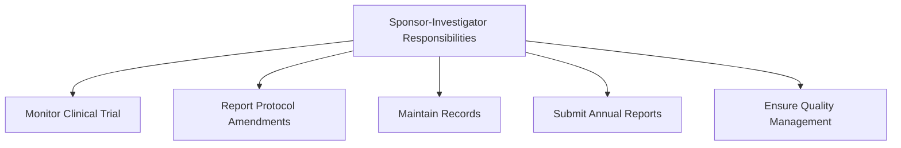
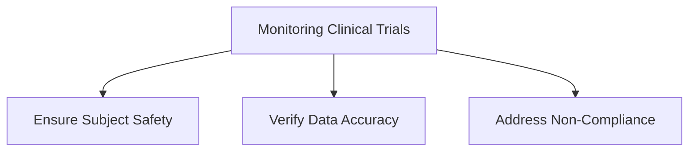
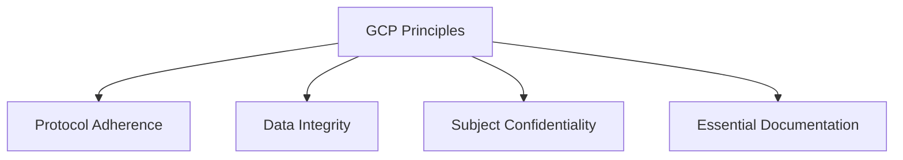

# Conducting Investigator-Initiated Studies According to FDA Regulations and GCP (ID 14614)

## Introduction
Medical research plays an essential role at academic organizations, focusing on novel therapies and new applications for existing drugs. When investigators initiate and conduct clinical trials, they must fulfill dual roles as both sponsor and investigator, adhering to FDA regulations and ICH guidelines.

---

## Learning Objectives

By the end of this module, you should be able to:

- State the criteria for when an IND is not required.
- Describe the role of sponsor-investigator.
- Indicate what documentation is required for INDs.
- State what reports are due to the FDA for active INDs.
- Describe the steps sponsor-investigators must take to determine whether events must be reported to the FDA.

---

## Key Definitions

- **Sponsor**: Entity initiating and taking responsibility for a clinical investigation. 
- **Sponsor-Investigator**: Individual who both initiates and conducts a clinical investigation under their immediate direction.
- **Letter of Cross-Reference Authorization**: Letter from a drug manufacturer permitting access to technical information for an IND submission.

---

## Exemptions from IND Requirement
Certain studies using marketed drugs are exempt from IND submission under specific conditions:

1. **Not intended** for FDA submission as evidence of a new indication or significant labeling changes.
2. **No increased risk**: The study must not alter the route, dosage, or patient population to increase risk.
3. Compliance with IRB and informed consent regulations (21 CFR Part 56 and 50).

---

## IND Application Process
### Studies with New Drugs
For investigational new drugs, an IND application must include:

- Cover letter
- Form FDA 1571 and 1572
- Investigator’s Brochure
- Protocol(s)
- Chemistry, manufacturing, and controls (CMC) information
- Pharmacology and toxicology data
- Previous human experience

### Studies with Marketed Drugs
For approved drugs being used for new indications, IND content requirements remain the same. A **package insert** can replace the Investigator’s Brochure.

### Letters of Cross-Reference
Drug manufacturers may provide a letter enabling the sponsor-investigator to use their IND data (e.g., CMC or pharmacology data).

---

## Sponsor-Investigator Responsibilities
Sponsor-investigators must fulfill both sponsor and investigator obligations, including:

- Developing a **quality management system** for trial conduct.
- Submitting protocol amendments, annual reports, and adverse event reports.
- Monitoring trial conduct through risk-based approaches and detailed monitoring plans.
- Maintaining essential documents and drug disposition records.
- Reporting non-compliance and implementing corrective actions.

---

## Required Reports for INDs

### Protocol Amendments
Amendments include:
- New protocols
- Changes to existing protocols
- Adding new investigators

### Adverse Events
- **Serious Adverse Events (SAEs)**: Report immediately to the sponsor and within 15 calendar days to the FDA.
- **Unexpected Fatal or Life-Threatening AEs**: Report within 7 calendar days.

### Annual Reports
Submitted to the FDA within 60 days of the IND’s anniversary date.

---

## Case Study: Dr. Chin’s Clinical Trial
Dr. Chin is conducting a study on Tagestat for treating Clostridium difficile. Key aspects include:

- Obtaining an IND for the new indication.
- Monitoring trial safety, including adverse event reporting.
- Addressing protocol deviations (e.g., ineligible subject enrollment).
- Ensuring compliance at all participating sites.

---

## Summary
Conducting investigator-initiated studies requires balancing the responsibilities of both sponsor and investigator. Key steps include submitting accurate IND documentation, implementing robust monitoring plans, and adhering to reporting requirements to ensure compliance with FDA regulations and GCP standards.

---

## Transcript Summary
**Video Transcript Highlights**:
- Dr. McDaniel discusses sponsor-investigator responsibilities with Dr. Hong.
- Key challenges include securing INDs and maintaining compliance with monitoring requirements.
- Effective communication and robust processes are essential for trial success.
# Conducting Investigator-Initiated Studies According to FDA Regulations and GCP (ID 14614)

## Monitoring Clinical Trials
### Purpose of Monitoring
Sponsor-investigators must develop monitoring plans based on the trial’s human subject protection and data integrity risks. Monitoring ensures:

- **Rights and well-being** of human subjects are protected.
- **Data accuracy and completeness** through verification from source documents.
- **Compliance** with protocols, GCP, and applicable regulations.

### Monitoring Activities
Monitoring includes:
- Creating a documented monitoring plan.
- Regular site visits and verification of data.
- Addressing non-compliance through corrective actions.

---

## Premature Termination or Suspension
ICH E6 guidelines mandate:

- Subjects must be promptly informed of termination or suspension.
- Sponsors, IRBs, and investigators must be notified with written explanations.
- Appropriate therapy and follow-up must be provided to subjects.

---

## Good Clinical Practice (GCP)
The ICH E6 guideline emphasizes:

- Design and performance of trials ensuring data credibility.
- Protection of trial subjects’ rights and confidentiality.

Key areas include:
- Protocol adherence
- Maintenance of essential documents
- Adherence to IRB and GCP standards

---

## Addressing Non-Compliance

### Protocol Deviations

Example: Dr. Abram enrolled ineligible subjects and altered doses without authorization.

Actions:
1. Monitor findings are documented.
2. Retraining for non-compliant investigators.
3. Addressing deviations with corrective actions.

---

## Case Study: Adverse Event Reporting

### Scenario
Dr. Chin’s subject experiences severe diarrhea leading to an acute myocardial infarction (MI). Diarrhea is expected with Tagestat, but MI is not. 

### Actions

1. Investigate the relationship between Tagestat and the MI.
2. Report the MI as an unexpected SAE.
3. Notify the FDA, IRB, and other participating investigators.

---

## Reporting Requirements

### Adverse Events
- **Serious Adverse Events (SAEs)**: Report immediately and follow up with detailed reports.
- **Unexpected Fatal or Life-Threatening Events**: Notify the FDA within 7 days.

### Annual Reports
Submit updates to the FDA summarizing:
- Study progress
- Protocol modifications
- Adverse event data

---

## Summary
Sponsor-investigators must:
- Develop comprehensive monitoring plans.
- Ensure compliance with GCP and FDA regulations.
- Adhere to robust reporting processes for adverse events.
- Address non-compliance proactively.

Through these measures, they uphold the integrity of clinical trials and safeguard subject well-being.
