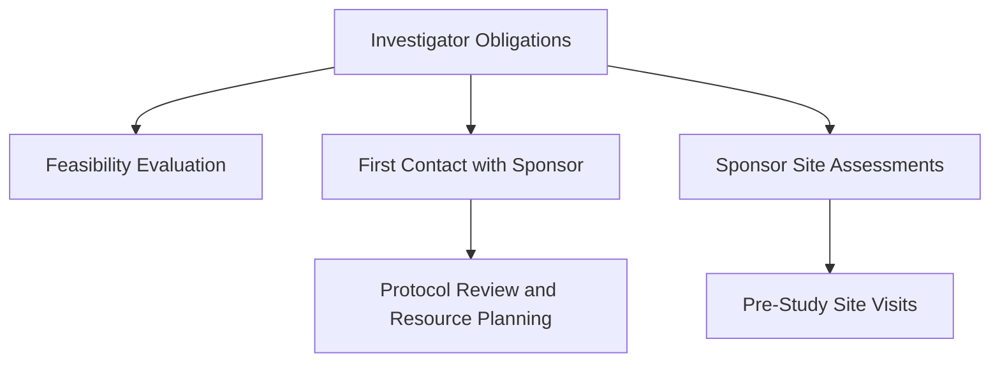
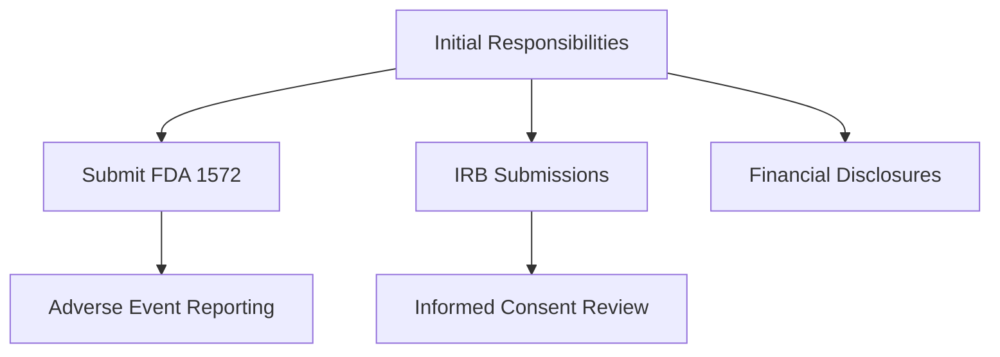
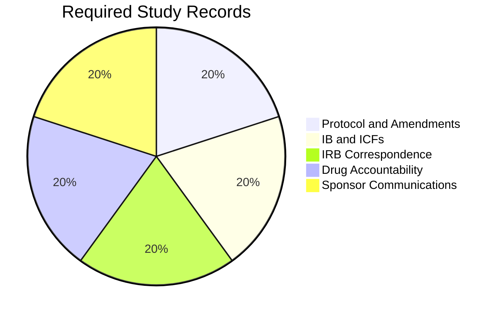
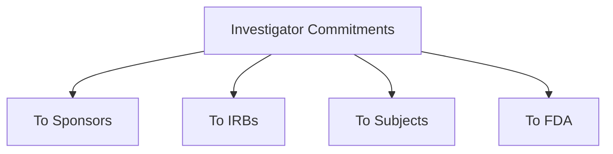

# Investigator Obligations in FDA-Regulated Research (ID 14615)

## Introduction
Investigators participating in clinical investigations sponsored by pharmaceutical companies assume professional and legal obligations to ensure the success of the study. They must adhere to FDA regulations and ICH guidelines to meet international standards for regulatory compliance.

---

## Learning Objectives
By the end of this module, you should be able to:

- Describe the commitments and obligations investigators assume when conducting industry-sponsored clinical investigations.
- Summarize the investigator's relationship with the sponsor organization.
- Identify investigator commitments to study subjects, the IRB, and the FDA.

---

## Key Definitions

- **Case Report Form (CRF)**: Tool to record clinical trial data, submitted to the sponsor.
- **Essential Documents**: Permits evaluation of study conduct and data quality (ICH E6 Section 1.23).
- **Informed Consent Form (ICF)**: Provides study information for subject consent.
- **Institutional Review Board (IRB)**: Reviews and approves biomedical research to protect human subjects.
- **Investigator's Brochure (IB)**: Summarizes clinical and non-clinical data for the investigational product.
- **Protocol**: Study plan detailing objectives, design, and procedures.
- **Source Data**: Original information for trial reconstruction and evaluation.
- **Validation of Computer Systems**: Ensures computer systems meet specified requirements.

---

## Investigator Obligations, Evaluation, and Preparation
### Obligations (ICH E6 Section 4.1):
- Be qualified by education, training, and experience.
- Be familiar with investigational products and applicable regulations.
- Permit monitoring and regulatory inspections.
- Maintain a delegation log for trial-related duties.

### Feasibility Evaluation:
- Assess expertise, resources, and interest.
- Confirm recruitment capability within the required timeframe.
- Ensure administrative and contractual readiness.

---

## First Contact with the Sponsor
### Questions to Ask Sponsors:
1. Study timeline and enrollment goals.
2. IND submission status and site activity.
3. Protocol position in the investigational product’s development plan.

### Investigator Assessment of Feasibility:
- Review protocol and IB for study requirements.
- Confirm administrative support, personnel availability, and resource adequacy.
- Ensure compliance with data accessibility and long-term record maintenance.

---

## Sponsor Site Assessments
### Sponsor Evaluation:
- Conduct pre-study site visits.
- Assess investigator’s qualifications (FDA 21 CFR 312.53).

### Adequate Resources (ICH E6 Section 4.2):
- Demonstrate recruitment potential and sufficient time.
- Ensure qualified staff, facilities, and adherence to protocol requirements.
- Supervise and train individuals delegated trial-related duties.

---

## Case Study: Investigative Site Evaluation
Myra, a research coordinator, evaluates site suitability for a phase II asthma trial. Dr. Thompson agrees to serve as Principal Investigator. Questions addressed:

- Adequacy of time, staff, and resources.
- Review of protocol and compliance requirements.
- Preparation of IRB submission and financial disclosures.

---

## Summary
Investigators must understand their dual obligations to sponsors, IRBs, and subjects. Feasibility assessments and sponsor interactions ensure resource readiness and compliance with regulatory standards. Proper preparation and documentation are critical to trial success.
# Investigator Obligations in FDA-Regulated Research (ID 14615) - Part 2

## Investigator Responsibilities

### Medical Care of Trial Subjects (ICH E6 Section 4.3):
- Ensure a qualified physician or dentist oversees all trial-related decisions.
- Provide adequate medical care for adverse events (AEs) and intercurrent illnesses.
- Inform primary physicians of trial participation if the subject consents.

### Initial Investigator Reports and Approvals:
- **Form FDA 1572**: Legally binds the investigator to comply with FDA regulations and protocol.
  - Personally conduct or supervise the study.
  - Report AEs to the sponsor.
  - Maintain accurate records and submit them for inspection.
  
- **IRB Submissions**:
  - Protocol, ICF, IB, and recruitment materials must be submitted for approval.
  - Notify sponsors of IRB-required changes.

### Financial Disclosures (FDA 21 CFR 54):
- Disclose financial interests in the sponsor or study outcome.
- Include spousal and dependent financial relationships.
- Update disclosures promptly if financial conditions change.

---

## Study Conduct and Oversight

### Site Initiation:
- Sponsor conducts initiation visits to review protocols and regulatory requirements.
- Drug shipment and recruitment begin post-initiation.

### Delegation of Authority:
- Investigators may delegate responsibilities but retain ultimate accountability.
- Maintain a **Delegation of Authority Log** documenting assigned tasks and personnel qualifications.

### Required Study Records:
- Protocol and amendments.
- IB, ICFs, IRB correspondence.
- Drug accountability records and sponsor communications.

### Record Retention:
- Maintain records for at least two years post-study completion or drug approval.
- Ensure data availability for inspections and audits.

---

## Protocol Compliance

### Deviation Handling:
- Deviations are permitted only to mitigate immediate hazards.
- Document and report deviations to the sponsor, IRB, and regulatory bodies.

### Reporting Requirements:
- Report SAEs promptly to the sponsor.
- Provide periodic updates and final reports to the IRB.
- Notify regulatory authorities of study suspension or termination.

---

## Commitments Overview

### To Sponsors:
- Recruit subjects and perform procedures within agreed timelines.
- Notify sponsors of protocol deviations and AEs.
- Maintain study records and communicate changes.

### To IRBs:
- Submit study materials for review and approval.
- Provide updates, SAEs, and study closure reports.

### To Subjects:
- Ensure informed consent and protect their welfare.
- Provide necessary medical care during and post-trial.

### To FDA:
- Comply with GCP standards and retain records for inspections.

---

## Summary
Investigators in FDA-regulated research bear significant responsibilities across compliance, reporting, and ethical care. Their commitments ensure data integrity and subject protection, contributing to the trial's success and regulatory approval.
