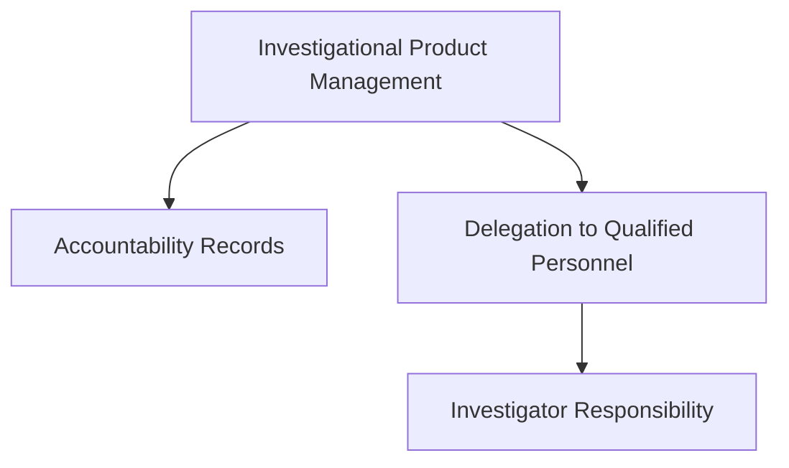
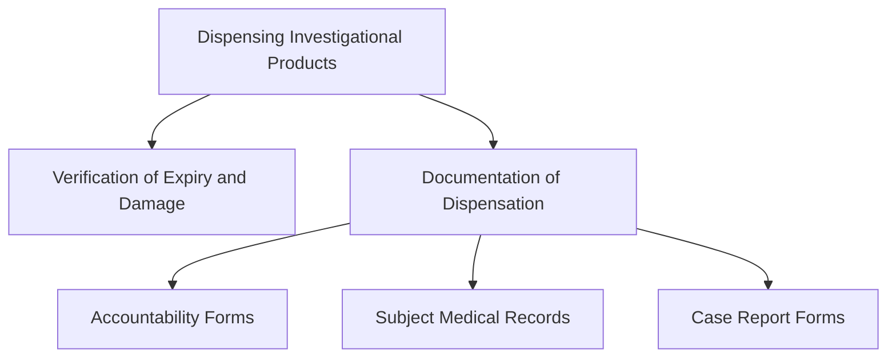
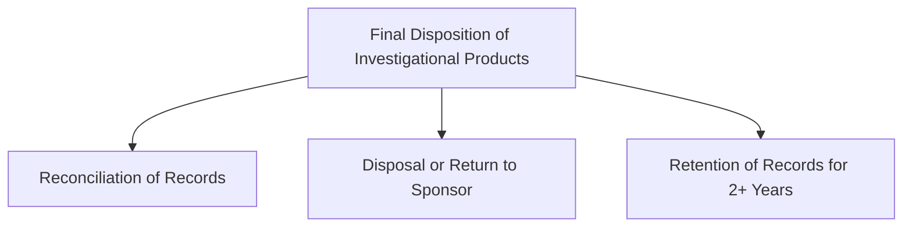

# Managing Investigational Agents According to GCP Requirements (ID 14617)

## Part 1: Introduction and Regulatory Framework

### Introduction

Good Clinical Practice (GCP) standards mandate specific protocols for managing investigational products. These include investigational drugs and biologics, which are regulated by the U.S. Food and Drug Administration (FDA) and similar agencies worldwide. This module outlines investigator responsibilities for handling these products in compliance with GCP standards, including FDA regulations and ICH E6(R2) guidelines.

---

### Learning Objectives

By the end of this module, you should be able to:

- Identify investigators’ regulatory obligations for investigational products.
- Discuss requirements for storage of investigational products.
- Describe the documentation of receipt, use, and final disposition.
- Manage investigational product use by study subjects.

---

### Key Definitions

- **Biological Product (Biologic)**: Defined under 21 CFR 600.3 as any therapeutic serum, toxin, antitoxin, or similar product for disease prevention or treatment.
- **Investigational Product**: Defined by ICH E6 Section 1.33 as a pharmaceutical form of an active ingredient or placebo used in a clinical trial.
- **Investigational New Drug (IND)**: Defined under 21 CFR 312.3 as a new or biological drug used in clinical investigations.

---

### Regulation of Investigational Products

The FDA oversees investigational product use in the U.S. Before shipping investigational products, the sponsor must file an Investigational New Drug (IND) application (Form FDA 1571). Documentation must include:

- Investigator credentials submitted via Form FDA 1572 (Statement of Investigator).
- Approval from the Institutional Review Board (IRB).

#### Controlled Substances

Additional requirements apply under the Controlled Substances Act for investigational drugs classified as controlled substances.

---

### Control of Investigational Products

#### Investigator Responsibilities

Under 21 CFR 312.61 and ICH E6 Section 4.6:

- Investigators must ensure investigational products are administered only to authorized subjects.
- Investigators are accountable for all product received, dispensed, and disposed of.
- Proper records must include dates, quantities, batch/serial numbers, expiration dates, and subject codes.

#### Delegation of Accountability

Investigators may delegate accountability to qualified personnel, such as pharmacists or study coordinators, but remain ultimately responsible.

---

### Packaging and Labeling

#### Importance of Packaging

Packaging ensures product integrity and facilitates randomization in trials. For example:

- Early-phase trials may use bulk containers.
- Later-phase trials often require subject-specific packaging.

#### Labeling Requirements

Per FDA regulations, investigational product labels must include:

- Study name and drug name (or placebo code).
- Subject study number and dosing details.
- Lot and batch numbers.
- Statement: "Caution: New Drug - Limited by Federal Law to Investigational Use."

---

### Shipping of Investigational Products

Sponsors must:

- Receive IRB approval before shipping.
- Ship only to investigators listed in the IND.
- Verify that shipments match accompanying documentation.

Upon receipt, investigators should inspect shipments for accuracy and damage. Any discrepancies must be reported to the sponsor immediately.

---

### Storage of Investigational Products

#### Requirements

Investigational products must be stored:

- According to sponsor specifications.
- In secure, access-controlled locations.
- With continuous monitoring of storage conditions (e.g., temperature logs).

#### Consequences of Improper Storage

Failure to maintain proper storage conditions may result in data disqualification or compromised product efficacy. Records must demonstrate adherence to storage requirements.

---

# Managing Investigational Agents According to GCP Requirements (ID 14617)

## Part 2: Dispensing, Subject Compliance, and Final Product Disposition

### Dispensing Investigational Products

#### Administering Investigational Products

- **Delegation**: Investigators may delegate administration to qualified personnel, ensuring they are trained and compliant with the protocol.
- **Protocol Adherence**: Investigational products may only be dispensed to subjects enrolled in the specific clinical trial.
- **Checking Expiry**: Always verify the expiration date and inspect the product for visible damage before dispensing.

#### Documentation of Dispensation

Records must include:

- Identification of the product administered.
- Dosage, date, and time.
- Subject identification code.

These details are typically documented in:

- Drug accountability forms.
- Subject medical records.
- Case report forms (CRFs).

---

### Managing Subject Compliance

#### Ensuring Compliance

Subjects must:

- Follow dosing instructions.
- Return unused products.

The investigator should:

- Provide clear, written instructions.
- Assess subjects’ understanding of instructions.
- Regularly monitor compliance during visits.

#### Methods for Monitoring Compliance

- **Written Directions**: Use labels and written instructions.
- **Compliance Diaries**: Subjects record their usage.
- **Regular Follow-ups**: Frequent communication ensures adherence.

---

### Unblinding and Randomization

#### Blinding in Clinical Trials

- In double-blinded studies, neither the investigator nor the subject knows the treatment assignment.
- Randomization codes correspond to treatment assignments to minimize bias.

#### Breaking the Code

- Sponsors provide procedures for code-breaking in emergencies.
- Premature unblinding should be documented with justification.

**Important**: Breaking the code may affect the study’s statistical significance and data integrity.

---

### Final Disposition of Investigational Products

#### Reconciliation

Investigators must reconcile investigational products by:

- Reviewing shipping, dispensing, and unused product records.
- Ensuring all products are accounted for.

#### Disposal or Return

- Follow sponsor directives for unused product disposal or return.
- Disposal methods must comply with local regulations and safety standards.

#### Record Retention

- Maintain records for at least two years post-study completion or product approval.
- Include all investigational product receipt, dispensation, and disposal records.

---

## Summary

Investigators must ensure investigational products are:

1. Dispensed only to enrolled subjects.
2. Stored and handled as per protocol.
3. Accounted for in detailed records.

Proper management of investigational products ensures compliance with GCP, protects subject safety, and maintains data integrity.
