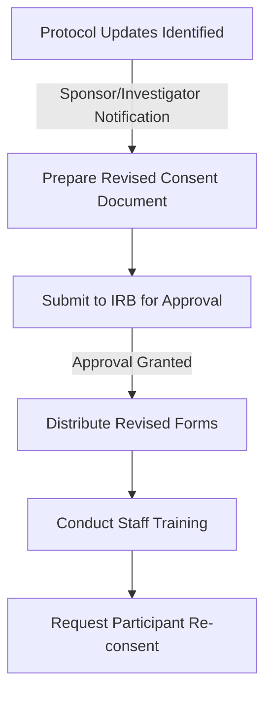
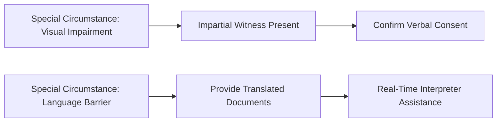
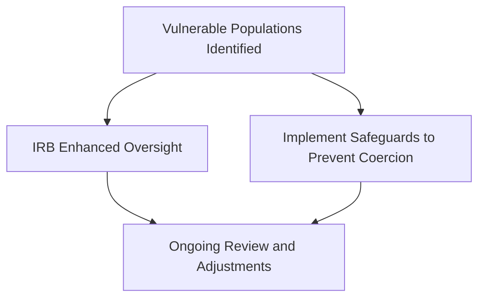

# Informed Consent in Clinical Trials of Drugs and Biologics

## Part 1: Overview and Regulatory Framework

### Introduction
This module discusses the informed consent process for clinical trials involving drugs and biologics, focusing on the requirements set forth by the International Council for Harmonisation (ICH) Good Clinical Practice (GCP) E6(R2) guideline and the U.S. Food and Drug Administration (FDA) regulations. The informed consent process ensures that study participants are fully informed of the study’s purpose, procedures, risks, and benefits before agreeing to participate.

---

### Learning Objectives
By the end of this module, you should be able to:
- Describe the process for obtaining informed consent.
- Describe the process for documenting informed consent.
- Define vulnerable populations and identify safeguards to protect them from undue influence and coercion.
- Outline exceptions to informed consent requirements under FDA regulations.
- Explain the requirements for waiving the documentation of informed consent.

---

### Key Definitions
- **Informed Consent:** A process allowing individuals to agree to participate in research with full knowledge of its purpose, procedures, and implications.
- **Legally Acceptable Representative (LAR):** An individual or body authorized under applicable law to consent on behalf of a prospective subject.
- **Vulnerable Subjects:** Individuals who may be unduly influenced to participate in research due to expectations of benefits or fear of retaliation.

---

### Informed Consent Process
The informed consent process involves:
- Recruitment, including advertising and initial discussions.
- Providing study information in a clear, understandable manner.
- Allowing subjects adequate time to consider participation.
- Answering subjects’ questions.
- Obtaining voluntary agreement and confirming continued consent throughout the study.

Subjects must also be informed of any new information that may influence their willingness to continue participation.

---

### General Requirements for Informed Consent
The informed consent process must:
- Be legally effective, involving individuals or authorized representatives who can provide consent.
- Use clear, non-technical language understandable to the subject or their representative.
- Occur under conditions that prevent coercion or undue influence.
- Provide subjects sufficient time to decide about participation.

#### Legally Effective Consent
Consent must be obtained from:
- The subject themselves, if capable.
- A legally authorized representative if the subject cannot consent personally, per local legal requirements.

#### Understandability
The language used must facilitate comprehension and should avoid technical jargon. The following are essential:
- Ample time for questions and thorough responses.
- No language suggesting waivers of legal rights or releasing the investigator from liability.
- Clear communication that participation is voluntary.

---

### IRB Review and Recruitment Methods
The Institutional Review Board (IRB) plays a critical role in reviewing and approving:
- Methods and materials used in the consent process.
- Recruitment strategies, including advertising.

Recruitment methods must comply with local laws and guidelines, and compensation practices must align with ethical norms.

#### Knowledge Check
**Question:** Should an IRB review an advertisement for recruiting study participants?
- **Correct Answer:** Yes, as recruitment is part of the informed consent process.

---

### Timing of Consent
Consent must be obtained and documented before any study-related procedures commence. For procedures done solely for research purposes, consent must precede activities such as:
- Questionnaires.
- Blood draws for eligibility assessment.

#### Knowledge Check
**Question:** When should a researcher obtain consent for a questionnaire and blood test required for eligibility?
- **Correct Answer:** Before conducting any study-related procedures.

---
### Part 2: Informed Consent Process - Additional Considerations and Detailed Scenarios

#### Managing Revisions in Consent Forms
As clinical trials progress, protocols may require updates due to newly identified risks, changes in procedures, or additional information relevant to participants. The informed consent process must adapt accordingly to ensure ethical compliance and participant understanding.

#### Revising Consent Documents
When protocol changes occur:

- The IRB must review and approve the revised consent form.
- Investigators should communicate the changes to study staff during training sessions.
- Current participants must be informed of the updates and asked to re-consent using the revised form.

#### Handling New Risk Information
When new risks are discovered, such as in the example of elevated liver enzymes in a trial:

1. Investigators must inform the IRB.
2. Revised documents including the new risks are prepared.
3. Participants are briefed on the risks before signing the updated consent form.

#### Case Study
In Dr. Apsen's trial:

- **Risk Discovery**: A 6% rate of liver enzyme elevation and one case of liver failure prompted immediate action.
- **Investigator Response**:
  - Reported the risks to the IRB.
  - Suspended new enrollments until revised consent forms were approved.
  - Conducted re-consent for existing participants.

#### Consenting Special Populations
Some participants may face unique challenges during the consent process, such as:

- **Visual Impairment**: If a subject cannot read the consent form:
  - An impartial witness must oversee the consent process.
  - The witness confirms that the subject understands and voluntarily consents.

- **Language Barriers**:
  - Use translated consent documents.
  - Provide an interpreter for real-time discussion.

#### Addressing Cultural Sensitivities
Cultural norms may influence consent:

- Investigators should:
  - Tailor consent discussions to the participant's cultural background.
  - Ensure voluntary participation is emphasized.
  - Use culturally appropriate communication styles.

#### Vulnerable Populations
Participants in vulnerable groups require additional safeguards:

- **Examples of Vulnerability**:
  - Economic or educational disadvantage.
  - Cognitive impairment or reliance on hierarchical structures (e.g., students or employees).
- **Regulatory Safeguards**:
  - Enhanced monitoring by IRBs.
  - Extra measures to prevent coercion.

#### Using Electronic Informed Consent (eIC)
Electronic consent (eIC) systems streamline the consent process but must adhere to GCP and regulatory standards.

- **Advantages**:
  - Improved accessibility for remote participants.
  - Multimedia elements for better comprehension.

- **Regulatory Compliance**:
  - Systems must meet FDA Part 11 standards for electronic records.
  - Participants must receive a copy of their signed consent form.

#### Summary
The informed consent process in clinical trials is a dynamic, ongoing interaction that demands attention to ethical principles, regulatory requirements, and participant needs. Whether managing protocol updates, addressing cultural considerations, or leveraging technology, investigators must prioritize participant understanding and autonomy.
