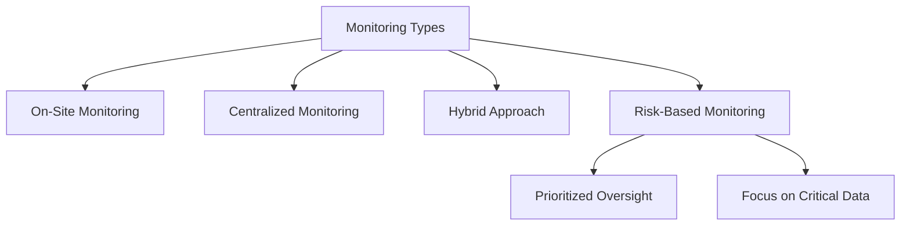
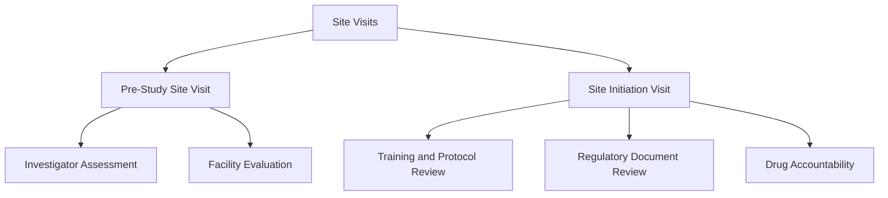
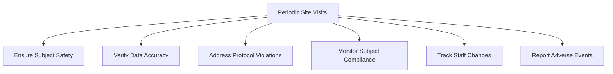
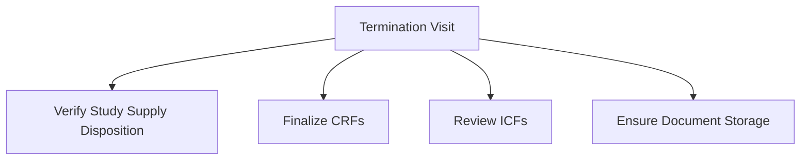
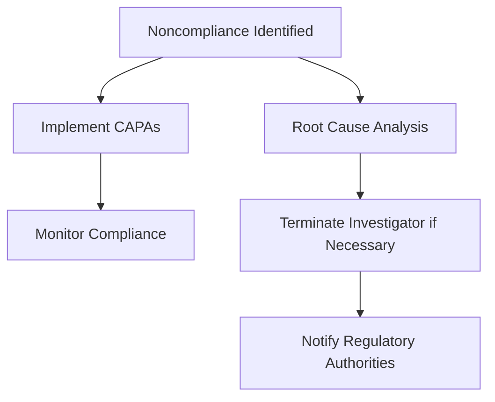
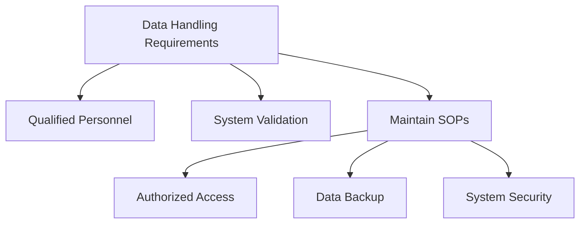

# Monitoring Clinical Trials of Drugs by Industry Sponsors (Part 1)

## **Introduction**

Monitoring is an essential process in clinical trials to ensure compliance with the protocol, applicable regulations, standard operating procedures (SOPs), and Good Clinical Practice (GCP). The International Council for Harmonisation (ICH) E6 guidelines and U.S. federal regulations mandate that sponsors oversee the progress of trials to guarantee their integrity.

### **Definition of Monitoring**
Monitoring is defined as “the act of overseeing the progress of a clinical trial and ensuring that it is conducted, recorded, and reported in accordance with the protocol, SOPs, GCP, and applicable regulatory requirements” (ICH [2016] E6 Section 1.38).

Monitoring can be conducted on-site, remotely (centralized monitoring), or using a hybrid approach.

---

## **Learning Objectives**
By the end of this module, you should be able to:
- Identify the types of site visits conducted by industry sponsors.
- Understand the basic requirements for each type of site visit.
- Describe the role of the investigative site during interactions with industry sponsors.
- Understand the requirements for site record-keeping as per FDA and ICH E6 guidelines.

---

## **Key Definitions**

- **Certified Copy**: A verified copy of the original record that contains the same context, content, and structure as the original (ICH [2016] E6 Section 1.63).
- **Essential Documents**: Documents permitting the evaluation of study conduct and data quality. Retention is required for at least two years after the marketing application’s last approval or the formal discontinuation of the investigational product’s development (ICH E6 Section 4.9.5).
- **Monitoring Plan**: A document detailing the strategy, methods, responsibilities, and requirements for trial monitoring (ICH [2016] E6 Section 1.64).
- **Monitoring Report**: A written report provided to the sponsor after site visits or trial-related communication (ICH [2016] E6 Section 1.39).
- **On-site Monitoring**: Monitoring performed directly at the clinical trial site (ICH [2016] E6 Section 5.18.3).
- **Centralized Monitoring**: Remote evaluation of accumulating data supported by trained personnel (ICH [2016] E6 Section 5.18.3).

---

## **The Sponsor's Role**

### **Regulatory Requirements**
ICH (2016) E6 Section 5.18 and U.S. regulations (21 CFR 312.56 and 312.53[d]) stipulate that sponsors must monitor clinical trials to:

1. Protect the rights and well-being of subjects.
2. Ensure that trial data are accurate, complete, and verifiable.
3. Confirm that the trial complies with the approved protocol, GCP guidelines, and regulations.

### **Responsibilities of Monitors**
Monitors are appointed by the sponsor and must be:
- Appropriately trained and qualified.
- Familiar with the protocol, investigational product, and regulatory requirements.

Monitors are required to provide timely reports to the sponsor following site visits or other trial-related communication (ICH E6 Section 5.18.6).

---

## **Types of Monitoring**

### **Traditional On-Site Monitoring**
Historically, monitoring has been conducted through on-site visits. This approach ensures direct oversight of trial activities at the investigator’s site.

### **Centralized Monitoring**
Centralized or remote monitoring evaluates data electronically and may involve data managers and biostatisticians. This method is increasingly used to complement on-site activities.

### **Risk-Based Monitoring**
The FDA and ICH guidelines encourage sponsors to adopt a systematic, risk-based monitoring approach tailored to:
- The study’s objective and design.
- The complexity, size, and endpoints of the trial.

---

## **Site Visits by the Sponsor**

### **Pre-Study Site Visit**
The sponsor evaluates investigators and sites before initiating a trial. This visit determines the site’s capability to conduct the trial effectively.

#### **Objectives**
1. Assess the investigator’s interest and qualifications.
2. Evaluate the site’s facilities, staff, and resources.
3. Determine the feasibility of meeting recruitment goals.

#### **Evaluation Criteria**
- Investigator and staff expertise.
- Availability of eligible research subjects.
- Adequate infrastructure and logistical support.

### **Site Initiation Visit**
After selecting the investigator and site, the sponsor initiates the study with training and protocol review.

#### **Key Activities**
1. Training the investigator and staff on protocol requirements and study-specific procedures.
2. Reviewing regulatory documents (e.g., Form FDA 1572, investigator CVs).
3. Verifying investigational product accountability.

---

## **Video Summary: Monitor Meetings with Site Staff**
In the accompanying video, Anne Parsons, a clinical research associate, conducts her third monitoring visit at Dr. Gale Hong’s site. Anne meets with David Clark, RN, the lead study coordinator, to review findings. Key takeaways include:

1. Acknowledgment of follow-up on previous deviations.
2. Confirmation of compliance with the latest consent form versions.
3. Emphasis on resolving discrepancies and maintaining documentation standards.

---
# Monitoring Clinical Trials of Drugs by Industry Sponsors (Part 2)

## **Periodic Site Visits**

Periodic monitoring visits are conducted to ensure compliance with the protocol, Good Clinical Practice (GCP), and applicable regulations. These visits can be performed on-site or remotely through centralized monitoring systems.

### **Objectives of Periodic Visits**
1. Confirm adherence to FDA regulations and GCP guidelines.
2. Ensure subject safety and protection of rights.
3. Verify protocol compliance.
4. Assess investigational product accountability.
5. Review Case Report Form (CRF) data accuracy and completeness.

#### **Key Monitoring Activities**
- **Subject Safety**: Assess adherence to safety protocols and informed consent requirements.
- **Data Verification**: Cross-check CRFs against source documents, such as medical records and laboratory results.
- **Protocol Violations**: Identify, record, and address any protocol deviations.
- **Subject Compliance**: Monitor investigational product use and adherence to study protocols.
- **Site Staff Changes**: Document personnel changes, verify qualifications, and ensure adequate training.
- **Serious Adverse Events (SAEs)**: Confirm proper reporting of adverse events to regulatory bodies and sponsors.

---

## **Termination (Study Closeout) Site Visit**

The termination visit ensures that the site has fulfilled all responsibilities related to the study. It typically occurs after the trial has been completed or discontinued.

### **Objectives of Termination Visit**
1. Verify disposition of study supplies and investigational agents.
2. Ensure all records are complete and appropriately stored.
3. Review and finalize CRFs.
4. Confirm proper documentation of informed consent forms (ICFs).

#### **Key Activities**
- **Investigational Product Disposition**: Confirm proper return or destruction of investigational products.
- **Data and Documentation Review**: Ensure all data are verified and submitted.
- **Site Staff Meeting**: Discuss any remaining issues and resolve discrepancies.

---

## **Handling Noncompliance**

### **Identifying Noncompliance**
Noncompliance occurs when the protocol, SOPs, GCP guidelines, or regulatory requirements are not followed. Sponsors are responsible for addressing such issues promptly.

#### **Sponsor Actions**
1. Conduct root cause analysis for significant noncompliance.
2. Implement corrective and preventive actions (CAPAs).
3. Terminate the investigator’s participation if compliance cannot be secured.
4. Notify regulatory authorities if necessary.

---

## **Record Retention Requirements**

### **Retention Periods**
- Retain study-related records for **at least two years** after the investigational product receives marketing approval or the study is terminated.
- For global studies, retention periods can extend to **five to ten years**, depending on regulatory requirements.

### **Essential Documents**
- IRB correspondence and approval letters.
- Investigator CVs and licenses.
- Protocols and amendments.
- Investigational product accountability records.
- Source records and CRFs.
- Subject identification and enrollment logs.

#### **Storage and Accessibility**
Records must be stored in a secure system that ensures:
- Document identification.
- Version history.
- Search and retrieval capabilities.
- Certified copies must meet ICH E6 standards.

---

## **Trial Management and Data Handling**

ICH E6 emphasizes the importance of accurate and reliable trial data. Sponsors must:
- Utilize qualified personnel for trial oversight.
- Validate electronic data handling systems.
- Maintain Standard Operating Procedures (SOPs) for data management.

### **Data Management SOPs**
- Ensure authorized access.
- Implement data backup protocols.
- Maintain a secure system to prevent data integrity issues.

---

## **Summary**

Monitoring clinical trials ensures compliance with regulations, protects human subjects, and guarantees data reliability. Both on-site and remote monitoring play essential roles in trial oversight. Proper handling of noncompliance, record retention, and data management are critical to the success of clinical trials.

