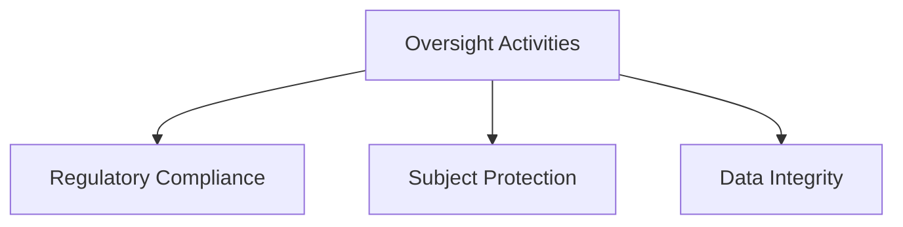
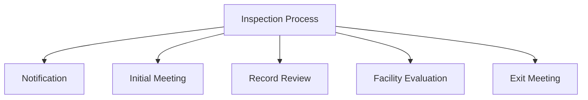
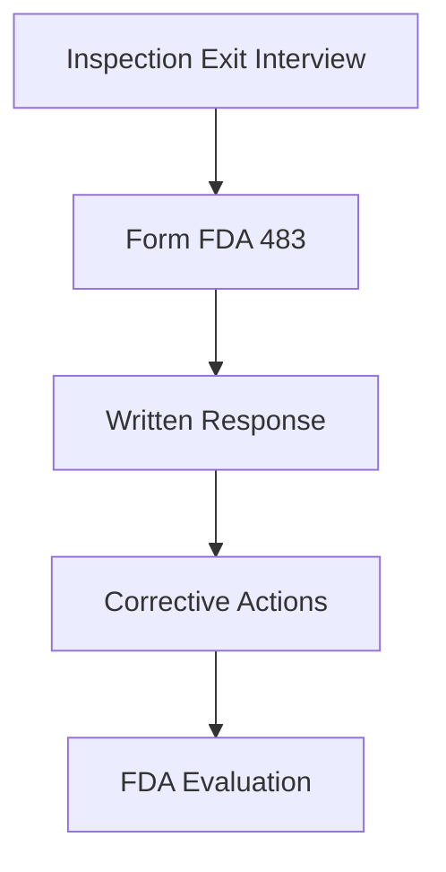
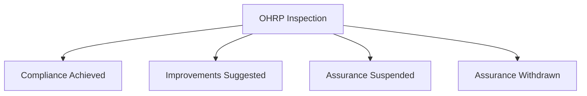

# Audits and Inspections of Clinical Trials of Drugs and Biologics (Part 1)

## **Introduction**

Clinical trials of investigational products in the United States fall under the purview of the U.S. Food and Drug Administration (FDA). These trials may be conducted with federal funding or external sponsorship. To ensure the protection of human subjects and the reliability of clinical data, regulatory agencies and sponsors oversee these trials through audits and inspections.

This module outlines the processes, objectives, and stakeholders involved in auditing and inspecting clinical trials conducted according to Good Clinical Practice (GCP) standards.

---

## **Learning Objectives**

By the end of this module, you should be able to:

- Identify entities that can inspect or audit clinical trials.
- Explain factors influencing an investigator’s likelihood of being audited.
- Understand the FDA’s Bioresearch Monitoring Program.

---

## **Definitions**

- **Audit**: A systematic and independent examination of trial-related activities and documents to verify adherence to the protocol, GCP standards, and applicable regulations (ICH E6 Section 1.6).
- **Inspection**: An official review conducted by regulatory authorities of documents, facilities, and records related to a clinical trial (ICH E6 Section 1.29).
- **Monitoring**: Ongoing oversight of a clinical trial’s progress to ensure compliance with the protocol and applicable standards (ICH E6).

---

## **Key Objectives of Auditing, Monitoring, and Inspecting**

All three processes share common goals:

1. Ensure adherence to regulatory requirements.
2. Protect human research subjects.
3. Maintain data integrity and study validity.

---

## **Comparison of Oversight Methods**

| **Method**      | **Conducted By**         | **Purpose**                                           | **Outcome**                          |
|------------------|--------------------------|-------------------------------------------------------|--------------------------------------|
| **Auditing**    | Sponsor, CRO, or Organization | Verify data integrity and trial processes as a quality assurance measure. | May lead to SOP changes or monitoring recommendations. |
| **Monitoring**  | Sponsor or CRO           | Ongoing assessment of compliance with study protocols. | Ensures protocol adherence during the trial.           |
| **Inspecting**  | Regulatory Agency        | Verify compliance with regulations and protect research subjects. | Can impact regulatory decisions on data validity.      |

---

## **FDA Bioresearch Monitoring Program (BIMO)**

The FDA’s Bioresearch Monitoring Program oversees:

- Clinical investigators.
- Investigative sites.
- Institutional Review Boards (IRBs).
- Sponsors, CROs, and monitors.
- Nonclinical laboratories.

### **Purpose**

- Ensure compliance with FDA regulations.
- Protect human subjects.
- Verify adherence to GCP and study protocols.

### **Compliance Program Guidance Manuals (CPGMs)**

The FDA’s CPGMs detail inspection processes and expectations for clinical trials, serving as valuable resources for preparation and execution.

---

## **Types of FDA Inspections**

1. **Study-Oriented Inspections**
    - Focus: Study data supporting a marketing application (e.g., New Drug Applications).
    - Objectives: Verify data accuracy, subject protection, and regulatory compliance.
    - Selection Criteria: Top enrolling sites and a random sample (10%) of other sites.

2. **Investigator-Oriented Inspections**
    - Focus: Specific investigators.
    - Trigger: Complaints of misconduct, fraud, or data fabrication.

### **Additional Selection Criteria**

Factors influencing site selection include:

- Subject enrollment numbers (high/low).
- Outlier data frequency.
- High rates of adverse events or protocol violations.
- Investigator’s specialty alignment with the trial.
- Past inspection history.

---

## **FDA Inspection Process**

### **Notification**

- FDA investigator contacts the clinical investigator to schedule the inspection.
- FDA issues Form FDA 482 (Notice of Inspection) upon arrival at the site.

### **During the Inspection**

- **Initial Meeting**: Discuss inspection objectives.
- **Record Review**: Evaluate regulatory and subject records for compliance.
- **Facility Evaluation**: Assess the adequacy of investigational product accountability and control.
- **Exit Meeting**: Conclude with feedback and review Form FDA 483 (if applicable).

### **Knowledge Check**

**Question**: What defines an audit in the context of clinical trials?

**Answer**: A systematic and independent examination of trial-related activities and documents.

---

# Audits and Inspections of Clinical Trials of Drugs and Biologics (Part 2)

## **Regulatory Documents**

During FDA inspections, regulatory documents help inspectors recreate the events of the trial conduct. Accurate, complete, and current records are essential for compliance.

### **Commonly Reviewed Documents**

| **Document**               | **Purpose**                                                                                   |
|----------------------------|-----------------------------------------------------------------------------------------------|
| **IRB Membership List**   | Provides information about IRB members to assess compliance with regulations (21 CFR 56).     |
| **IRB Correspondence**    | Documents approvals, amendments, progress reports, and safety updates.                       |
| **Investigator Brochure** | Provides details about the investigational product.                                           |
| **Investigator CVs**      | Validates qualifications of investigators and subinvestigators.                               |
| **Informed Consent Forms**| Ensures compliance with consent requirements and protection of subjects.                      |
| **Investigational Product Records** | Tracks the receipt, use, and disposition of investigational products.                 |
| **Site Delegation Logs**  | Lists personnel authorized for significant trial duties.                                      |
| **Monitoring Logs**       | Records sponsor visits and findings.                                                          |

---

## **Inspection Outcomes**

### **Exit Interview**

At the conclusion of the inspection, the FDA investigator conducts an exit meeting to discuss findings. Observations may be documented on Form FDA 483 (Inspectional Observations).

### **Common Deficiencies**

1. **Failure to Follow Protocol**: Includes unapproved deviations.
2. **Inadequate Recordkeeping**: Missing or incomplete documentation.
3. **Investigational Product Accountability**: Unaccounted test articles.
4. **Consent Issues**: Missing or improperly executed forms.

### **Responding to FDA 483**

1. Respond in writing within 15 business days.
2. Address each observation with corrective actions and timelines.
3. Prepare a root cause analysis for systemic issues.

---

## **Post-Inspection Actions**

### **Establishment Inspection Report (EIR)**

After the inspection, the FDA investigator prepares an EIR summarizing findings and any supporting evidence. The FDA reviews this alongside responses to determine compliance.

### **Possible Letters Issued by FDA**

1. **No Action Indicated (NAI)**: Compliance observed.
2. **Voluntary Action Indicated (VAI)**: Minor deviations requiring resolution.
3. **Warning Letter**: Serious violations requiring immediate corrective action.

---

## **Sponsor Audits and Monitoring**

Sponsors may perform audits as part of quality assurance. These audits are distinct from routine monitoring and focus on compliance with GCP and regulatory requirements.

### **Sponsor Responsibilities**

- Appoint independent and qualified auditors.
- Develop an audit plan based on trial complexity, subject risks, and identified issues.
- Ensure corrective actions for noncompliance.

### **Corrective Actions for Noncompliance**

- Conduct root cause analysis.
- Implement preventive measures.
- Notify regulatory authorities if necessary.

---

## **Office for Human Research Protections (OHRP) Inspections**

### **Scope**

OHRP oversees federally funded research to ensure compliance with 45 CFR 46. Inspections target compliance with ethical principles and human subject protections.

### **Possible Outcomes**

1. **Compliance**: No issues found.
2. **Improvements Suggested**: Minor adjustments recommended.
3. **Assurance Suspended**: All studies halted until compliance is reinstated.
4. **Assurance Withdrawn**: Long-term suspension of research activities.

---

## **Case Study**

### **Scenario**

Dr. Thompson’s site is audited and later inspected by the FDA. Issues include missing investigational product records and unapproved protocol deviations.

### **Resolution Steps**

1. Conduct internal audits to identify gaps.
2. Train staff on documentation and protocol adherence.
3. Respond to FDA observations with corrective action plans.

---

## **Summary**

Audits and inspections are vital to ensuring compliance, protecting human subjects, and maintaining data integrity in clinical trials. Investigators, sponsors, and organizations must proactively address deficiencies to uphold GCP standards and regulatory requirements.

