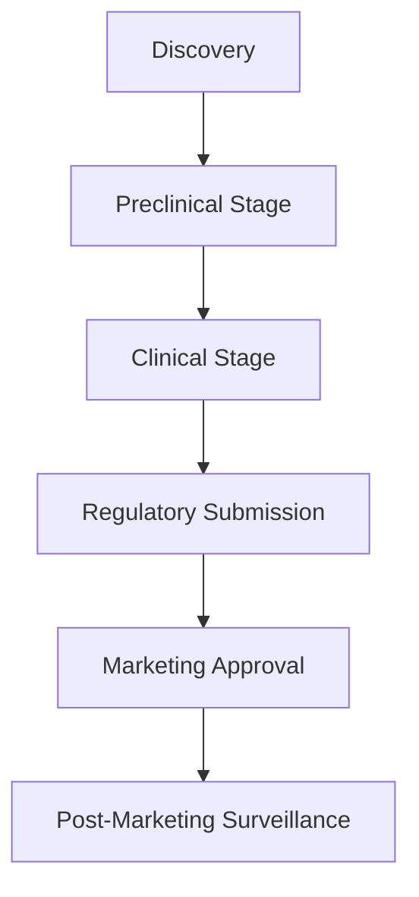
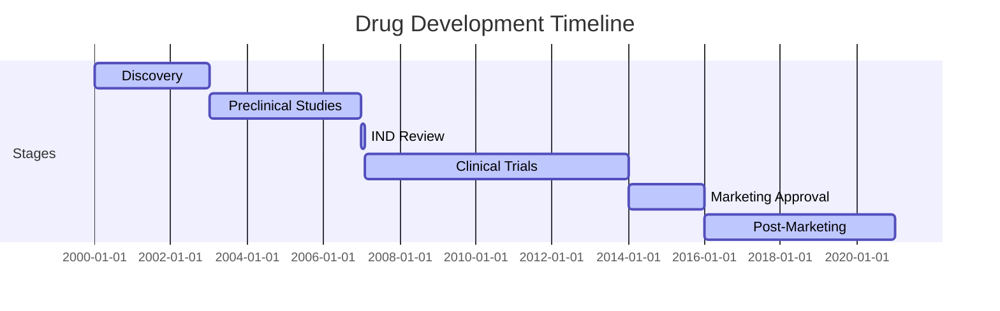
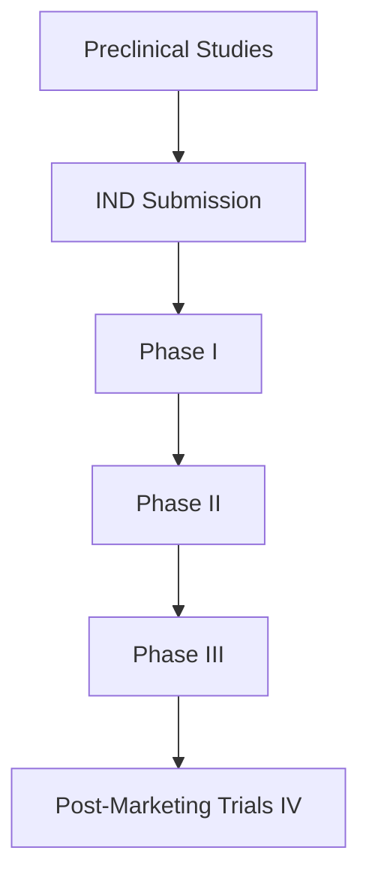
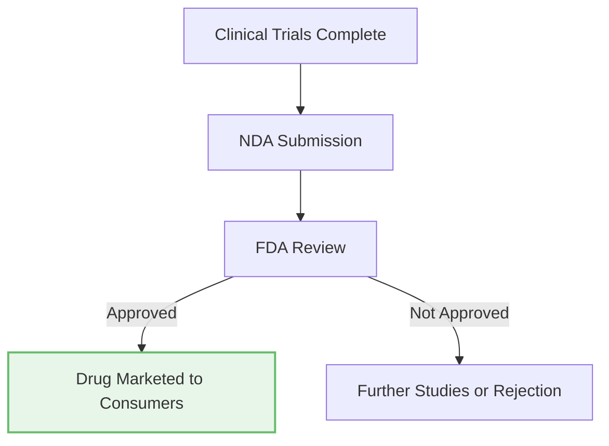

# Overview of New Drug Development (Part 1)

## **Introduction**

Developing a new drug is a lengthy and complex process that typically spans an average of twelve (12) years, from conceptualization to obtaining a marketing permit. Most new drugs, or new uses of existing drugs, must undergo clinical trials to demonstrate their safety and efficacy.

This module describes the drug development process, focusing on U.S. Food and Drug Administration (FDA) regulations for clinical trials under Investigational New Drug (IND) applications and the subsequent submission of New Drug Applications (NDAs) for marketing approval.

---

## **Learning Objectives**

By the end of this module, you should be able to:

- Describe the IND process.
- Discuss the drug development process.

---

## **Definitions**

### Key Terms:

- **Bioavailability**: The rate and degree to which a drug is absorbed and becomes available at the target site in the body.
- **Clinical Trial**: An investigation involving human subjects to evaluate the effects of an investigational product on safety, efficacy, and pharmacological properties.
- **Controlled**: Clinical studies in which subjects are divided into at least two groups, typically including one receiving the investigational product and one receiving a control, such as a placebo or standard treatment.
- **Good Clinical Practice (GCP)**: International ethical and scientific standards ensuring credible trial data and protecting trial subjects' rights and confidentiality.
- **Investigator**: The individual responsible for conducting a clinical trial at a site and managing the investigational product.
- **Pharmacodynamics**: The study of a drug's effects within the body.
- **Pharmacokinetics**: The study of how a drug moves through and is eliminated from the body.
- **Sponsor**: The entity responsible for initiating and overseeing a clinical trial, which may be a company, academic organization, or individual.

---

## **Overview of Drug Development**

The drug development process begins with discovering a compound with therapeutic potential, which is then studied through:

1. **Preclinical Stage**:
   - Testing conducted in silico (computer models), in vitro (cell cultures), and in vivo (animal models).
   - Assesses safety and effectiveness.

2. **Clinical Stage**:
   - Testing in human subjects through phased trials.
   - Seeks to demonstrate safety, efficacy, and suitability for the target population.

3. **Regulatory Submission**:
   - Sponsors submit evidence from clinical trials to the FDA for review.
   - The FDA decides on marketing approval.

### Role of ICH E6 Guidelines

The International Council for Harmonisation (ICH) E6 guideline standardizes clinical trial practices globally, ensuring compliance with regulatory requirements across different regions.

---

## **Purpose of Clinical Trials**

Clinical trials aim to distinguish a drug’s effects from other influences, such as:

- Natural progression of the disease.
- Placebo effects.
- Biased observation.

The FDA requires "substantial evidence" from clinical trials to support new drug efficacy claims (21 CFR 314.126(a)). Sponsors achieve this by:

- Defining optimal dosing and administration routes.
- Testing drug formulations and combinations.
- Assessing pharmacokinetics and pharmacogenomics.
- Measuring quality-of-life improvements in subjects.

---

## **IND Applications**

Before clinical trials can begin, sponsors must file an IND application (Form FDA 1571) with the FDA, providing:

- Preclinical study results.
- Detailed study protocols.
- Information about the investigational drug’s composition, manufacturing, and safety.

### Key Documents in the IND Application:

1. **Investigator’s Brochure (IB):**
   - Contains preclinical and clinical data about the investigational product.
   - Guides investigators on dose, administration methods, and expected adverse events.

2. **Form FDA 1572:**
   - Declares investigators’ qualifications and commitments to adhere to regulations.

3. **Annual Progress Reports:**
   - Includes safety updates, protocol amendments, and study progress.

The FDA reviews the IND application to ensure subject safety before granting permission for clinical trials to proceed.

---

## **Preclinical Studies**

The preclinical phase (3-6 years) evaluates:

- Drug activity in tissue cultures and animal models.
- Pharmacokinetics and bioavailability in animal systems.

Positive results support the transition to human trials.

---

## **Timeline of Drug Development**

The process progresses through defined stages, summarized below:

---

### IND Submission: 30 Days

As noted previously, before conducting human clinical trials with an investigational drug, the sponsor must file an IND application (Form FDA 1571) with the FDA. This application includes all known information about the investigational product, such as the results of preclinical studies.

- **Review Process**: The FDA has thirty (30) days to review this information to determine the relative safety of the investigational drug before allowing it to be tested in humans. If there are concerns or questions about the drug or the study plan, the FDA contacts the sponsor and places a clinical hold on the trial, preventing the sponsor from proceeding with the research.
- **Proceeding with Research**: If the 30-day review period passes without notification from the FDA, the sponsor may proceed with the research as described in the IND application.
- **Verification Requirement**: Investigators must verify with the sponsor or the FDA that no clinical hold has been placed on the IND before enrolling subjects in the trial.

### Clinical Trials: 6-7 Years

Clinical trials of investigational drugs are conducted through a systematic approach. Table 1 below summarizes the three major phases of clinical trials.

#### Table 1. Phases of FDA-Regulated Clinical Trials

| Trial Phase | Goals                                                                 | Subject Population                                                                                 |
|-------------|----------------------------------------------------------------------|---------------------------------------------------------------------------------------------------|
| **Phase I** | Assess toxicity. Determine drug's pharmacokinetic and pharmacodynamic profiles. Determine doses resulting in sufficient biological levels of the drug. | Normal healthy volunteers unless toxicity prevents exposure (e.g., cancer drugs). In such cases, subjects with end-stage disease might be enrolled. |
| **Phase II** | Determine drug's short-term risks (safety). Examine preliminary effectiveness of the drug. | Controlled studies enrolling limited numbers of subjects.                                         |
| **Phase III** | Determine drug's effectiveness. Determine long-term drug safety. Confirm Phase II findings. | Controlled and uncontrolled studies (typically placebo-controlled and double-blinded) enrolling larger subject numbers and seeking to confirm results of Phase II trials. |

### Case Study

Dr. Consume has been working on a new drug to treat non-small cell lung cancer (NSCLC). This investigational drug targets an enzyme expressed by tumor cells. Key aspects of her drug development process include:

1. Preclinical studies show the drug is effective against tumors expressing the enzyme, but it has side effects such as vomiting and diarrhea.
2. Dr. Consume writes a protocol for a multi-site Phase I clinical trial to test safety in humans with NSCLC.
3. She submits an IND application to the FDA on March 1. The FDA acknowledges receipt on March 7. By April 9, Dr. Consume has not heard back and is considering starting the trial.

#### Knowledge Check Questions

- **May Dr. Consume administer the drug to herself?**
- **What phase of the investigation is Dr. Consume’s clinical trial?**
- **Can she ship the drug and may her colleagues start recruiting study subjects?**
- **What must Dr. Consume provide to her colleagues before they begin enrolling subjects at their site?**
- **What regulation must Dr. Consume comply with to use an electronic system to capture research data for her clinical trial?**

### New Drug Application (NDA) Submission: 6 Months - 2 Years to Review

When sufficient data have been obtained to provide evidence of safety and efficacy, the sponsor submits the trial’s results to the FDA as part of an NDA, requesting permission to market the product in the U.S.

- **Review Process**: The FDA reviews the application and decides whether to approve the drug for marketing.
- **Outcome**: Only after FDA approval of the NDA can the drug be sold to consumers.

### Post-Marketing: Ongoing

In many cases, clinical trials continue even after a marketing application is approved. These post-marketing studies (Phase IV) serve several purposes:

- **Voluntary Studies**: Drug companies collect long-term safety and efficacy data or compare the drug with others on the market.
- **Regulatory Requirements**: The FDA might require Phase IV trials to gather more information on efficacy and safety, especially for drugs approved through accelerated processes.

### Electronic Records and Signatures

#### FDA Regulations for Electronic Records and Signatures

- **21 CFR Part 11**: Specifies processes to ensure electronic documents are equivalent to paper documents. Key requirements include:
  - **Accuracy and Reliability**: Computer systems must ensure data accuracy, reliability, and consistency.
  - **Audit Trails**: Systems must maintain secure, computer-generated, and time-stamped audit trails.
  - **Access Control**: Only authorized individuals may access the system and perform operations.

#### ICH Requirements for Electronic Records

ICH E6 Section 5.5.3 specifies similar requirements for electronic trial data systems, including the need for certified copies of records and validated processes for generating such copies.

### Clinical Trials Registration and Results Submission

Applicable clinical trials must be registered and results submitted to ClinicalTrials.gov per 42 CFR 11. Key points include:

- **Responsible Party**: The sponsor is usually responsible for registering the trial and submitting results.
- **Posting Consent Forms**: HHS regulations require at least one consent form per trial to be posted on a publicly available federal website.

### Summary

Understanding the drug development process, including IND applications and clinical trials, is essential for compliance with FDA regulations. The development of drugs is a multiyear process that involves numerous stakeholders and rigorous testing across several phases.
