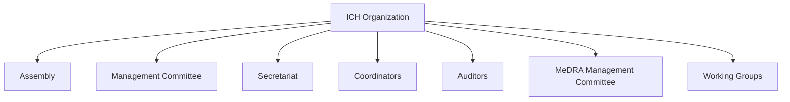
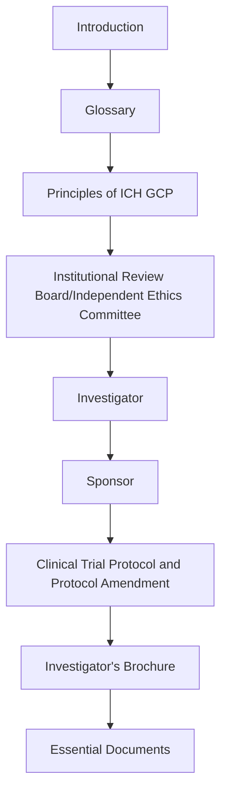
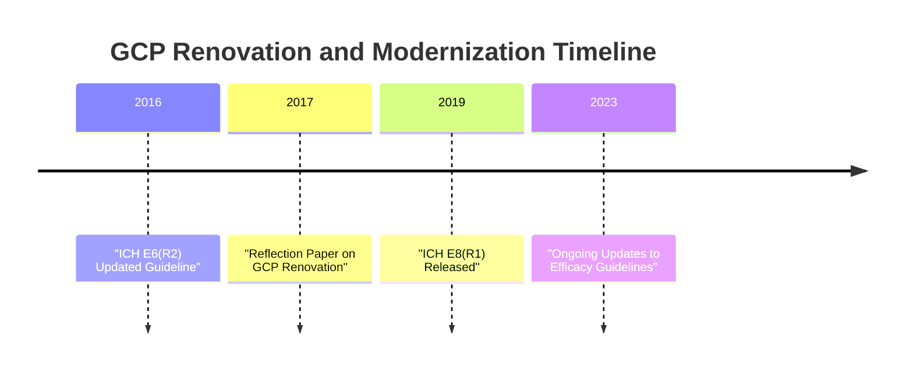
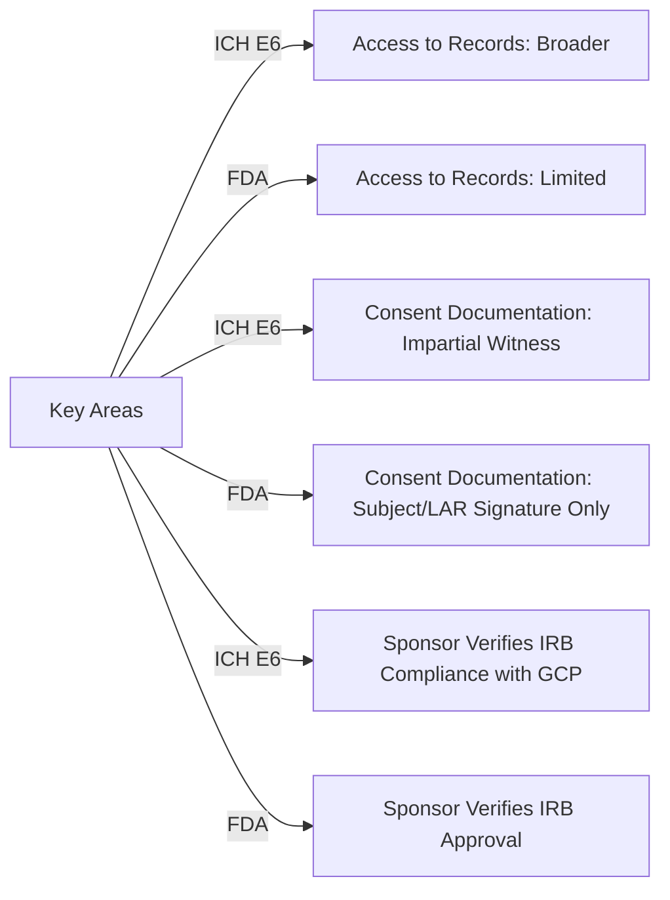

### Module 9: Overview of ICH GCP (ID 14622) - Part 1

#### Introduction
Before the International Council for Harmonisation (ICH) E6 guideline, the standards for the conduct of clinical trials varied from country to country. Consequently, it was often necessary to repeat clinical trials where approval was being sought to meet the different countries' variable standards and requirements.

Repeating the trials was costly and time-consuming for manufacturers. In addition, the variations between the standards in different countries resulted in some poorly designed and conducted trials.

In the early 1990s, regulatory and industry representatives from the European Union (EU), Japan, and the U.S. came together to form the International Conference on Harmonisation of Technical Requirements for the Registration of Pharmaceuticals for Human Use, commonly referred to as the International Conference for Harmonisation (the ICH revised its name in 2015 to the International Council for Harmonisation).

The formation of ICH led to the creation of many guidelines, including the Guideline for Good Clinical Practice (GCP) called ICH E6. The goal of the Council is to standardize technical guidelines and requirements for drug marketing registrations. This means that applications for marketing to various regulatory agencies around the world can occur without redundant testing.

The ICH guidelines have become the international standard for the design, conduct, monitoring, and reporting of clinical research of investigational drugs. Compliance with GCP standards enhances the protection of study subjects and the integrity of the data collected during a trial.

Similar to regulations and policies, the guideline for good clinical practice (ICH E6) is reviewed and revised periodically. In 2016, the ICH revised the E6 guideline. The changes are meant to reflect the current research landscape, including increases in globalization, study complexity, and technological capabilities. The revised guideline is entitled **"Integrated Addendum To ICH E6(R1): Guideline For Good Clinical Practice E6(R2)."**

#### Learning Objectives
By the end of this module, you should be able to:

- Describe the purpose of the ICH.
- Identify the basic requirements for compliance with ICH E6 guideline for good clinical practice.
- Describe how the ICH E6 guideline fits with U.S. federal regulations regarding clinical research.

---

#### Definitions
- **Legally Authorized Representative (LAR):** "An individual, judicial, or other body authorized under applicable law to consent on behalf of a prospective subject, to the subject's participation" in the procedure(s) involved in the research (ICH 2016).
- **Protocol Deviation (or Violation):** Generally "an unplanned excursion from the protocol that is not implemented or intended as a systematic change" (FDA 2015).

---

### ICH Organization
The ICH has grown and evolved since it was originally founded in the 1990s. Currently, the organization includes an assembly, management committee, secretariat, coordinators, auditors, MedDRA management committee, and working groups.

Each technical topic selected for harmonization has a working group and maintains a work plan (ICH 2019a). The management committee oversees the working groups.

The ICH (2015) E6 expert working group included twenty members, representing the six founding ICH regulatory and industry members, as well as new council members and observers.

**Learn more about the six original founding ICH members...**

---

### When Does the ICH E6 Guideline Apply?
After the ICH E6 guideline was finalized, several countries adopted it as law. However, in the U.S., the FDA adopted the ICH E6 only as guidance (U.S. Department of Health and Human Services [HHS] and FDA 1997) and subsequently adopted the revised ICH E6(R2) as guidance as well (FDA 2018a).

Therefore, the ICH E6 guideline does not have the force of law in the U.S. and is not regulation.

In the Federal Register notice, the FDA stated that ICH E6 "does not create or confer any rights for or on any person and does not operate to bind FDA or the public. An alternative approach may be used if such approach satisfies the requirements of the applicable statutes, regulations, or both" (HHS and FDA 1997).

**Compliance with the guideline is voluntary in the U.S., but as with any published FDA guidance, compliance is considered part of GCP.**

Increasingly, sponsors want investigators to meet the ICH E6 requirements.

For sponsors, the advantage of complying with ICH E6 is that FDA-equivalent government agencies in other countries will consider studies conducted in accordance with the guideline to meet the regulatory requirements of the drug approval processes.

However, certain requirements of ICH E6 are not included in FDA or HHS regulations. Investigators should be aware of the differences between ICH E6 guideline and FDA and HHS regulations so that they can fully comply with the ICH E6 requirements when requested by sponsors.

---

### ICH Topics and Guidelines

ICH has developed over sixty (60) guidelines to date in four categories: Quality, Safety, Efficacy, and Multidisciplinary Topics.

| **Category**          | **Explanation**                                                                                  | **Examples**                                                                                         |
|-----------------------|----------------------------------------------------------------------------------------------|-----------------------------------------------------------------------------------------------------|
| **Quality (Q) Topics** | Relating to chemical and pharmaceutical quality assurance                                      | Q1A Stability Testing of New Drug Substances and Products; Q3A Impurity in New Drug Substances      |
| **Safety (S) Topics**  | Relating to in vitro and in vivo preclinical research                                         | S1 Carcinogenicity Studies; S7A Safety Pharmacology Studies for Human Pharmaceuticals              |
| **Efficacy (E) Topics**| Relating to research in human subjects                                                        | E4 Dose-Response Information to Support Drug Registration; E6 Guidance for Good Clinical Practice  |
| **Multidisciplinary (M) Topics** | Topics that do not fit uniquely into one of the categories above                             | M1 Medical Dictionary for Regulatory Activities (MedDRA); M2 Electronic Standards for Transmission |

The management committee and expert working groups assist in the development and updating of the standards.

The expert working groups are established to develop new guidelines and revise existing guidelines. These working groups are endorsed by the ICH Assembly, usually based on a concept paper. Concept papers outline the main goals and rationale for revisions.

The **"Formal ICH Procedure"** includes a five-step process that is followed for the harmonization of all new and revised ICH guidelines (ICH 2019b). This process includes reaching consensus among members, regulatory consultation and discussion, adoption of the harmonized guideline, and implementation.

ICH guidelines and new requirements are then standardized across agencies and countries.

---

### ICH E6: Guideline for Good Clinical Practice

The ICH E6 Good Clinical Practice topic falls under the **"Efficacy"** category in the ICH guidelines. GCP pertains specifically to the conduct of clinical research to support marketing applications for drugs. This guideline is one of over 20 guidance documents issued in the efficacy category. The efficacy category focuses on topics related to the "design, conduct, safety, and reporting of clinical trials" (ICH 2019c).

The ICH E6 guideline provides a unified standard for designing, conducting, recording, and reporting research involving human subjects.

The two important goals of this standard are to assure that:

1. The rights, well-being, and confidentiality of trial subjects are protected.
2. Trial data are credible.

#### Sections of the ICH E6 Guideline
The complete **"Integrated Addendum to ICH E6(R1): Guideline for Good Clinical Practice E6(R2) Guideline"** is posted on the ICH website. The ICH E6 guideline is organized in eight sections (plus an introduction):

- **Introduction:** A general overview describing the purpose of GCP as an international standard.
- **Section 1: Glossary:** Comprehensive glossary of terms integral to clinical research.
- **Section 2: Principles of ICH GCP:** Detailed objectives of international ethical principles.

#### Continued Sections of the ICH E6 Guideline

- **Section 3: Institutional Review Board/Independent Ethics Committee (IRB/IEC):**
  IRBs/IECs oversee research involving human subjects to ensure the protection of their rights, safety, and welfare. This section details the specific duties and responsibilities of IRBs/IECs in clinical trials.

- **Section 4: Investigator:**
  This section outlines the obligations of investigators, including qualifications, resources, medical care for subjects, IRB/IEC interactions, protocol compliance, investigational product management, informed consent, recordkeeping, and reporting. Investigators must ensure that any delegated tasks are conducted properly and implement systems to ensure data integrity.

- **Section 5: Sponsor:**
  Sponsors are responsible for implementing a quality management system throughout all aspects of clinical trials, including trial design, conduct, recording, and evaluation. Responsibilities include ensuring oversight of Contract Research Organizations (CROs), monitoring, auditing, adverse drug reaction reporting, and maintaining investigational product supplies.

- **Section 6: Clinical Trial Protocol and Protocol Amendment(s):**
  This section specifies the content standards for clinical trial protocols and amendments. Topics include subject selection, treatment plans, safety and efficacy assessments, statistical methods, direct access to source data, quality control, ethics, data handling, financing, and publication policies.

- **Section 7: Investigator's Brochure:**
  This section describes the necessary content of the Investigator’s Brochure (IB), which provides detailed information about the investigational product to inform investigators.

- **Section 8: Essential Documents for the Conduct of a Clinical Trial:**
  Summarizes the requirements for essential documents needed to evaluate trial conduct and data quality. It provides a comprehensive list of required records and their purposes.

---

#### Other Pertinent ICH Documents

The ICH has developed numerous documents critical to drug discovery, development, and manufacturing. Examples include:

- **ICH E2A:** Clinical Safety Data Management - Definitions and Standards for Expedited Reporting.
- **ICH E8:** Guidance on General Considerations for Clinical Trials, focusing on trial quality and safety.

---

#### GCP Renovation and Modernization of ICH E8 and E6

In 2017, the ICH released a reflection paper, "GCP Renovation: Modernization of ICH E8 and Subsequent Renovation of ICH E6." The goal is to provide flexible guidance suitable for diverse research environments while maintaining GCP principles. Updates include focusing on trial quality factors and cross-referencing related guidelines for a cohesive framework.

The revised ICH E8(R1), released in 2019, emphasizes:

- Building quality into clinical trial design.
- Identifying critical factors influencing trial quality.

---

### Key Differences: FDA Regulations vs. ICH Guidelines

While ICH E6 is based on FDA regulations (21 CFR 50 and 56), some distinctions exist:

- **Guidance vs. Law:**
  ICH E6 is not legally binding in the U.S. but complements FDA regulations. Compliance is often requested by sponsors.

- **Access to Records:**
  ICH E6 requires broader access to confidential medical records for trial monitoring, audits, and inspections compared to FDA regulations.

- **Consent Documentation:**
  ICH E6 mandates more detailed consent processes, including impartial witnesses for non-readers and additional elements in consent forms.

- **Sponsor Responsibilities:**
  ICH E6 requires sponsors to ensure IRB compliance with GCP and verify subjects’ consent to grant access to medical records.

- **Assent:**
  ICH E6 requires assent from adults unable to consent unless exceptions apply, while FDA requirements are less specific.

---

#### Summary

ICH E6 guideline serves as a comprehensive framework for designing and conducting clinical trials. While compliance with ICH E6 is voluntary in the U.S., adhering to these standards ensures global acceptance of trial data, enhances subject protection, and supports the integrity of research findings.

Investigators and sponsors should assess their compliance levels to meet ICH requirements without compromising ethical or regulatory obligations.
